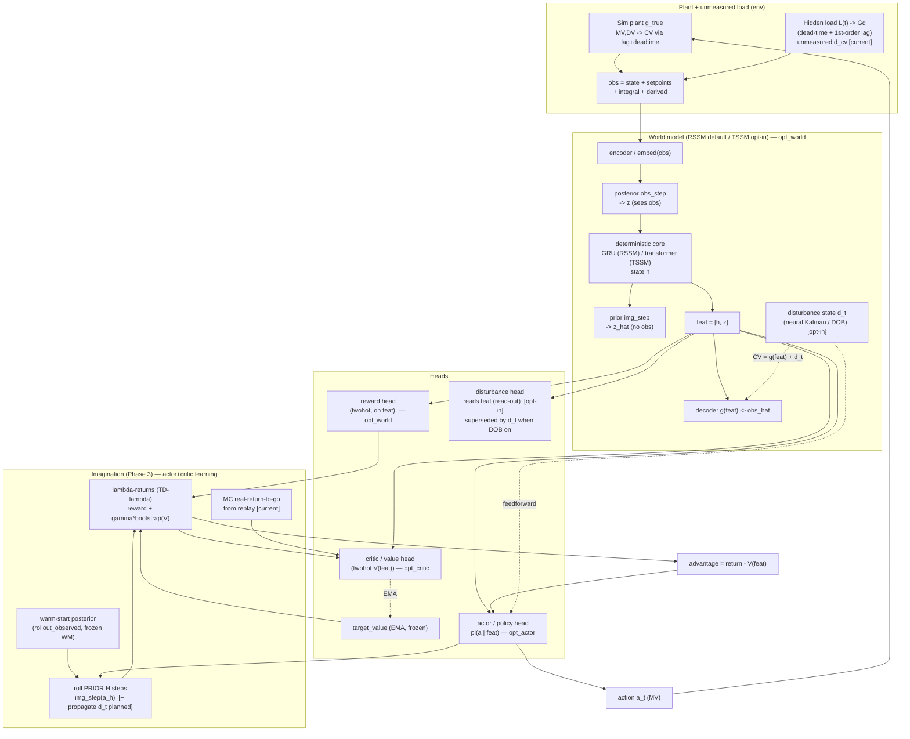
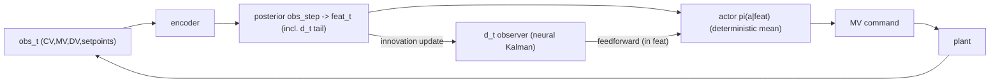
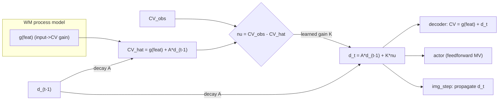

# neural-apc-mbrl — World-Model + Actor-Critic Architecture

Living architecture reference for the model-based APC controller. Keep this in
sync with the code when the data flow changes (it is part of the repo on
purpose). Backbone-agnostic: the **RSSM** (default) and **TSSM** (transformer,
opt-in via `DREAMER_WORLD_MODEL_TYPE=tssm`) are duck-compatible — `TSSMState`
mirrors `RSSMState` (`.h`, `.z_logits`, `.z`, `.feat`, `.stoch_flat`) and both
expose `obs_step` / `img_step` / `decode` / `rollout_observed`, with
`feat = cat([h, stoch_flat])` and `decode(feat) → obs`.

Status legend: **[current]** = implemented & default · **[opt-in]** = implemented,
env-gated off · **[planned]** = designed, not yet built.

> **2026-06-11:** the neural-Kalman-filter / DOB disturbance observer (§3) is now
> **implemented** in both backbones (`models/dreamer_v4_rssm.py`,
> `models/transformer_ssm.py`), env-gated **off** by default
> (`DREAMER_DOB_ENABLED=1` to turn on). It was validated by Exp A (p113): with
> the hidden disturbance OFF the WM gain recovered 0.36→0.18 and the autoencoder
> real→posterior 0.77→0.94, confirming the unmeasured load was an omitted
> variable attenuating the gain — exactly what the DOB de-confounds.

> **2026-06-22:** the **continuous gain+disturbance latent (§3b, C3)** supersedes
> the DOB as the default direction (`DREAMER_CONT_LATENT_ENABLED=1`). One Gaussian
> latent fixes BOTH the subdominant DV-gain categorical-attenuation bias (≈0.85,
> via the C(1) gain-match) AND the unmeasured-disturbance estimate (an inherent
> amortized Kalman, **no DOB**). The DOB stays in the code as a one-flag fallback
> (`DREAMER_DOB_ENABLED=1`) until the cont disturbance is verified to recover
> (detrended r ≥ the DOB's 0.354). First run: p137.

---

## 1. Full architecture (training)

### Reading the diagram
- **World model** learns the plant from `obs`: `encoder → posterior z` (sees obs),
  `prior z_hat` (predicts z without obs — the imagination engine), deterministic
  core `h`, and `decoder g(feat) → obs_hat`. Trained by `opt_world`
  (recon + KL + overshoot/held-rollout). The **disturbance head** [opt-in] is a
  gradient-isolated read-out probe today; the **DOB `d_t`** [planned] replaces
  it with a real state (Section 3).
- **Critic** `V(feat)` [`opt_critic`] is trained two ways: the imagined
  **λ-returns** (TD-λ, bootstrapped by the EMA `target_value`) **and** the
  **MC real-return-to-go** grounding (`critic_mc_grounding_coef`, the p106 win)
  so the value reflects realised economics, not just self-consistent imagination.
- **Actor** `π(a|feat)` [`opt_actor`] is trained on the **advantage**
  `return − V(feat)` via REINFORCE/PMPO (+ a decaying masked expert-BC anchor).
  It is the ONLY thing that drives `action → plant`.
- **Three optimizers are strictly partitioned** (verified by
  `tools/_smoke_grad_isolation.py`): `opt_world` (encoder/core/decoder + reward
  head [+ disturbance head]), `opt_actor` (policy), `opt_critic` (value).
  `target_value` and `prior_policy` are frozen (in no optimizer).

---

## 2. Inference / deployment (closed loop)

Only the **encoder + posterior + actor** run in closed loop at deploy time (the
critic, reward head and imagination are training-only). With the DOB enabled,
`d_t` is estimated online from the prediction error and fed forward to the actor
(it is appended to `feat`, so the deployed actor conditions on it directly).

---

## 3. [opt-in] Neural Kalman filter / disturbance observer (DOB)

Implemented 2026-06-11 (`DREAMER_DOB_ENABLED=1`, default off). The unmeasured load is an **omitted variable**: the WM cannot attribute that CV
movement to any input it sees, so it under-fits the input→CV gain
(MV ratio ≈ 0.64, DV ratio ≈ 0.73 in p112) — which makes the actor over-actuate
and oscillate, and makes a read-out disturbance head unrecoverable. The fix is a
learned **predict–correct observer** (a neural Kalman filter / DOB) bolted onto
the shared `feat → decode` interface so it transfers to **both** backbones.

- **Predict** (`img_step`, no obs): `d_t = A·d_{t-1}`; `CV_hat = g(feat) + d_t`.
- **Correct** (`obs_step`, real obs): `ν_t = CV_obs − (g + A·d_{t-1})`;
  `d_t = A·d_{t-1} + K·ν_t` (`K` = **learned** Kalman gain).
- **Output**: decoder `CV = g(h,z) + d_t`. `g` now learns the *true* gain because
  `d_t` absorbs the unexplained movement (de-confounds the attenuation). The
  recon loss compares `g(feat)+d_t` vs `obs`, and an L2 prior on `d_t`
  (`dob_reg_coef`, the Kalman "process-noise-is-small" assumption) keeps the
  model using `d_t` only for the genuine residual.
- **Disturbance estimate**: `d_t` itself is the estimate — `wm_disturbance_prediction`
  reads it directly (converted to engineering units via the obs-norm std),
  superseding the read-out head when DOB is on.
- **Feedforward (Scope 2, shipped 2026-06-11)**: `d_t` is appended to `feat`
  (`feat = [h, z_flat, d_t.detach()]`) so the actor / critic / reward heads
  condition on the disturbance estimate and pre-empt the load (prediction-error
  feedforward, not just feedback). `d_t` is **detached** into `feat` (the DOB is
  trained by the recon innovation, not head gradients); the **decoder reads only
  the core `[h, z_flat]`** (slices the d-tail) so the `g + d_t` factorisation is
  preserved. Scope 1 de-confounds the gain; Scope 2 adds the explicit feedforward.

Classical mapping: process model = learned WM dynamics; measurement model =
decoder; `K` = learned Kalman gain (per-CV, `sigmoid` ∈ (0,1)); `d_t` =
bias/disturbance state; holding `d_t` (decayed by `A`, per-CV `sigmoid` ∈ (0,1))
through imagination = the MPC "persistent disturbance" assumption, learned.
Implemented once at the shared `feat → decode` interface so RSSM + TSSM share the
observer math. Env knobs: `DREAMER_DOB_ENABLED` / `_REG_COEF` / `_DECAY_INIT` /
`_GAIN_INIT`. Verified by `tools/_smoke_dob.py` (both backbones: A/K bounded,
decay/correct, CV-only add, grad-isolated into `opt_world`).

---

## 3b. [current] Continuous gain+disturbance latent (C3) — the DOB-free direction

Shipped 2026-06-22 (`DREAMER_CONT_LATENT_ENABLED=1`, first run p137). A small
**Gaussian latent alongside the categorical** (`_ContinuousLatent` in
`models/dreamer_v4_rssm.py`) gives the precision-critical **continuous** quantities
an un-quantized home that the 32-class categorical attenuates — the shared root
cause of (a) the subdominant DV-gain bias (≈0.85) and (b) the disturbance read-out
collapse when the DOB is removed (p136: head amplitude 2% of true). One change
fixes BOTH:

- **GAIN block** (`cont_gain_dim = n_cv·(n_mv+n_dv)`): inferred in-context from the
  lookback, feeds the GRU (so `h` carries the per-episode gain forward) **and**
  the decoder. Supervised by **C(1) gain-matching** (`_wm_gain_match_loss`): a
  finite-difference step-response asymptote (roll the prior K=`gain_match_len`
  steps, held baseline vs +`gain_match_step` per MV/DV input, ΔCV/step) matched to
  the identified steady-state gain in WM-normalized units
  (`gain_match_mv_target`/`gain_match_dv_target`, resolved by
  `_resolve_gain_match_targets` from `dynamics_identification.json` + obs-norm +
  action scale: `g_dv_norm = g_eng·obs_std[dv]/obs_std[cv]`,
  `g_mv_norm = g_eng·mv_action_scale/obs_std[cv]`). `sample=False` freezes the
  categorical so the gain gradient flows into the continuous channel + decoder —
  the un-cheatable DC supervisor.
- **DISTURBANCE block** (`cont_dist_dim = n_cv`): an **inherent amortized Kalman**.
  The posterior `q(c|h,embed,ν)` infers the load from the one-step CV
  **innovation** `ν = cv_obs − prior-CV-forecast` (the DOB residual that carries
  the load) — fed EXPLICITLY since **p140**, because a posterior on `[h,embed]`
  alone learned an excited-CV shortcut that died under closed-loop control (p139:
  closed-loop `det_r(c_dist) 0.03` while `det_r(ν) 0.32`). It is supervised
  toward the recorded true load (`dist_match_coef`, p138) and the prior `p(c|h)`
  rolls it forward (OU) via the KL-balanced continuous KL (`rssm_cont_kl_loss`).
  ν needs a prior decode (too costly per-step in the compiled loop), so
  `rollout_observed` computes it BATCHED across two compile-friendly passes
  (pass 1 harvests prior feats → one batched decode → ν; pass 2 re-rolls feeding
  ν so the `c` that feeds `h` is innovation-driven). In **imagination** the
  disturbance block rolls **DETERMINISTICALLY** (prior MEAN, not a sample —
  `cont_dist_deterministic_roll`, p140 RCA): it is a feedforward signal, so a
  per-rollout sample would inject uncontrollable noise into the imagined reward
  and bury the action signal (the gain block stays sampled).

  > **⚠ SUPERSEDED for the disturbance (p142, after 5 failed runs p137–141).** The
  > learned cont-disturbance block never reliably encoded the load on held-out
  > data (p141 held-out `det_r` 0.32→**−0.05**; `dist_match` *diverged* at 0.6) —
  > ν confounds the load with the WM's own gain error, so it is not cleanly
  > identifiable. The disturbance is reverted to the classical **DOB** (the
  > neural-Kalman observer, §3; proven `det_r` 0.354). **When `dob_enabled` AND
  > `cont_latent_enabled`, the config resolves to GAIN-ONLY cont** (`cont_dist_dim
  > =0`, `dist_match_coef=0`): the cont latent keeps only the GAIN block, the DOB
  > owns the load (`d_t` in `feat`, Scope-2), and `gain_match` pins `g` so `d_t`
  > cleanly gets the load residual (no gain↔disturbance fight). The staged
  > clean→disturbance curriculum (the textbook sysID recipe) activates
  > automatically with the DOB on.

`feat = [h, z_flat, c, (dv), (d)]`; the decoder reads `[h, z, c, (dv)]`. Both
blocks feed the GRU transition. `cont_gain_dim == cont_dist_dim == 0` ⇒
byte-identical to the pre-cont model (regression-verified). Env knobs:
`DREAMER_CONT_LATENT_ENABLED` / `_MIN_STD` / `_MAX_STD` / `_FREE_BITS` /
`_KL_SCALE` / `_GAIN_PERSIST_COEF`, `DREAMER_GAIN_MATCH_COEF` / `_LEN` /
`_MAX_STARTS` / `_STEP`, `DREAMER_DIST_MATCH_COEF` (the disturbance-match
supervision, auto-**0.6** when the cont disturbance block is on AND the DOB is
off — the DOB-off fallback only; p141 found 0.6 backfired so the disturbance is
now the DOB's job), `DREAMER_CONT_DIST_DET_ROLL` (deterministic imagination roll,
default on). Threaded through all 5 `DreamerV4Config` build sites.
**Both RSSM AND TSSM are runnable** (p137 RSSM live-validated; TSSM parity is a
real recompute impl — `cont_kl`, `gain_match_loss`, the innovation 2-pass all
smoke-pass on both backbones).

> **DV→obs static skip removed (p141)**: the p132 zero-init `W·dv_t` decoder
> skip (`dv_static_skip`, now **default OFF**) was a memoryless feedthrough —
> physically wrong (DV→CV has dead-time) and a `gain_match` crutch that let the
> dynamic DV path stay weak. The cont GAIN block + `gain_match` supersede it;
> the measured DV still feeds the decoder via `dv_feedforward` (p129) and drives
> the CV through the recurrence. `DREAMER_DV_STATIC_SKIP=1` restores it (ablation).

### Continuous-latent curriculum (the simplified path)

When `cont_latent_enabled` (DOB off), the staged §4 curriculum is replaced by the
`_cont_curric` branch in `train()`: **WM-id (P1+P2): `g` TRAINS WITH the
disturbance present** — the cont gain channel + gain-match de-confound the gain
*inherently*, so there is **no clean-P1 / frozen-g-P2 staging** (that existed only
to protect the gain from the disturbance/DR confound), and the cont disturbance
channel learns from the disturbance being present — then **actor on the frozen WM
(P3)**. DR stays **off** (robustness via imagination gain-rand). **DR-on for
in-context gain ADAPTIVITY is the next-run item, gated on a gain-tracking probe
(verify the gain channel infers the per-episode gain before enabling DR-on).**

---

## 4. [opt-in] Staged clean→disturbance curriculum

Shipped 2026-06-12 (`DREAMER_CURRICULUM_ENABLED=1`, default off; **requires
`DREAMER_DOB_ENABLED=1` + phased mode** — it hard-disables with a warning
otherwise). It is the textbook system-identification recipe applied to the DOB:
**identify the plant `g` on clean data → identify the observer `(A,K)` on the
fixed plant → train the controller.** This removes the gain↔disturbance
identifiability confound that co-training `g` and `d_t` on disturbed closed-loop
data creates (p114/p115: `d_t` "steals" gain from `g`). The three stages map to
the existing phases P1/P2/P3 (budgeted by `phase{1,2,3}_frac`); the per-stage
freeze is `DreamerV4.set_world_model_trainable(g, dob, reward)` (toggles
`requires_grad`; `opt_world` skips frozen params) and `set_dob_active(...)`.

The DOB is built ON for the whole run so `feat` is always `core + n_cv` wide —
**no head-dim change at a stage boundary**. In Stage 1 the estimate is *suppressed*
(`d_t ≡ 0`), not removed.

| | **Stage 1 = P1** (plant id) | **Stage 2 = P2** (observer id) | **Stage 3 = P3** (controller) |
|---|---|---|---|
| **trainable** | `g` (enc/dec/GRU/prior/post) + reward | DOB `(A,K)` + reward | actor + critic + reward |
| **frozen** | DOB `(A,K)` | **`g`** | **`g` AND DOB** |
| **DOB `d_t`** | suppressed (`≡0`) | active | active (feeds actor via `feat`) |
| **unmeasured disturbance** | **OFF** (prob 0) | **ON** (prob 1.0) | ON (prob 0.85) |
| **measured DV (FEED)** | ON | ON | ON |
| **domain randomization** | ON (±10% τ/gain/dead-time) | ON | ON |
| **process+meas noise** | ramped 0→full (≈40% prog) | ~full | **full** (curriculum →1.0 in P3) |
| **collection** | random-action (open-loop) + seed buffer | random-action (now disturbed) + expert reinject | **on-policy** (actor closes loop) + eval + expert reinject |
| **what it learns** | unbiased input→CV **gain** | Kalman `(A,K)` on the fixed plant | reject disturbances (`d_t` feedforward) + economics |

- **Stage 1** — `d_t≡0` forces `g` to explain *all* CV movement, so the gain is
  identified with no omitted-variable escape hatch. The data is clean of the
  *unmeasured* load; the *measured* DV stays in (it is a WM input), and DR + a
  ramped noise curriculum keep the family realistic. Open-loop excitation comes
  from **random-action collection + the seed buffer** (small-noise holds + PRBS
  sweeps [+ const/step/expert when enabled]).
- **Stage 2** — `g` is frozen, so the recon innovation can only be reduced by
  `d_t`: the observer `(A,K)` is identified on the fixed plant (identifiable by
  construction). Reuses the P2 loss (`wm_total + agent_total`); BC also warms the
  actor as a free bonus. The disturbance is at max density (prob 1.0) so the
  observer sees plenty of residual.
- **Stage 3** — `g` and `(A,K)` are frozen (`_wm_frozen_now` drops `wm_total`);
  the actor/critic train on the static unbiased WM + working observer, **with
  disturbances + domain randomization on**, so the deployed controller is robust
  at runtime. The reward head keeps adapting.

> **Stage-1 excitation (verified p117):** the seed buffer is **settle-aware**, not
> random-only — it carries constant-action episodes (full-episode hold, 4–10×
> settle time), step-settle episodes (hold u₀→step→hold u₁ to episode end, `>>τ`
> tail, noise-free), step-test episodes, and PRBS with a slow hold ≈ `(θ+4τ)/sr`
> (≈4τ ≈ 98% settled); P1 re-injects const+step every 20 iters (anti-eviction).
> So the schedule **does** consider time-to-steady-state. **Empirically (p117
> clean Stage-1 gain probe): the dynamics are essentially perfectly identified**
> (posterior→1-step gain ratio ×0.998); the residual gain under-read sits in the
> **autoencoder** (real→posterior ×0.847) + mild compounding (×0.905), i.e. it is
> an encoder/decoder/latent-capacity bottleneck (the small CV step-gain gets
> squashed), **not** a non-settling/excitation problem. The lever is the
> CV-weighted recon (`wm_recon_cv_weight`) / per-CV obs-norm / larger latent —
> not more step-tests.
>
> **Note (2026-06-12):** the WM-only excitation **partition**
> (`wm_excitation_buffer_frac`) was **removed** — it was only ever drawn in the
> P3/joint WM-update path (inert in this phased curriculum), never demonstrably
> helped, and (per the p117 probe above) the dynamics are already fully
> identified without it. Stage-1 open-loop excitation comes from the settle-aware
> seed buffer + random-action collection + P1 const/step re-injection.

Verified by `tools/_smoke_curriculum.py` (per-stage `requires_grad` partition +
`dob_active` toggle + gradient isolation: S1 recon trains `g` not the DOB, S2
trains the DOB not `g`, S3 leaves the WM static) and `tools/_smoke_curriculum_e2e.py`
(real phased `train()`: all three stage transitions fire, recon finite through
the freezes, WM frozen by S3). Both backbones.

---

## 5. Code map

| Component | Where |
|---|---|
| RSSM (`obs_step`/`img_step`/`decode`/`rollout_observed`) | `models/dreamer_v4_rssm.py` |
| TSSM (transformer, duck-compatible) | `models/transformer_ssm.py` |
| Heads (reward/value/policy/disturbance), param groups | `models/dreamer_v4.py` (`parameters_world/_actor/_critic`) |
| WM loss (recon/KL/overshoot/held-rollout, disturbance) | `training/train.py` (`world_model_loss`, `_disturbance_head_loss`) |
| Imagination + λ-returns + MC grounding + actor/critic | `training/train.py` (`_imagination_step_rssm`, `imagination_step`) |
| Hidden load + Gd disturbance | `utils/hidden_disturbance.py` (`HiddenDisturbance`) |
| Neural Kalman filter / DOB (`d_t` state) | `models/dreamer_v4_rssm.py` + `models/transformer_ssm.py` (`dob_enabled`, `obs_step`/`img_step`/`apply_dob`); recon in `training/train.py:_rssm_world_model_loss` |
| Staged curriculum (per-stage freeze + DOB suppression) | `models/dreamer_v4.py` (`set_world_model_trainable`, `set_dob_active`); stage latch in `training/train.py` (`curriculum_enabled`, per-iter stage hook) |
| Gradient-isolation audit | `tools/_smoke_grad_isolation.py` |
| DOB smoke (both backbones) | `tools/_smoke_dob.py` |
| Curriculum smoke (unit + e2e) | `tools/_smoke_curriculum.py`, `tools/_smoke_curriculum_e2e.py` |
| Disturbance-prediction diagnostic | `evaluation/wm_disturbance_prediction.py` |
| WM gain / posterior-prior probes | `evaluation/wm_transfer_matrix.py`, `tools/wm_posterior_prior_probe.py` |
