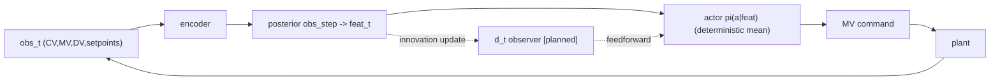
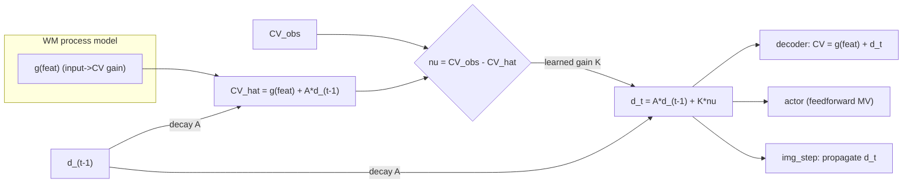

# neural-apc-mbrl — World-Model + Actor-Critic Architecture

Living architecture reference for the model-based APC controller. Keep this in
sync with the code when the data flow changes (it is part of the repo on
purpose). Backbone-agnostic: the **RSSM** (default) and **TSSM** (transformer,
opt-in via `DREAMER_WORLD_MODEL_TYPE=tssm`) are duck-compatible — `TSSMState`
mirrors `RSSMState` (`.h`, `.z_logits`, `.z`, `.feat`, `.stoch_flat`) and both
expose `obs_step` / `img_step` / `decode` / `rollout_observed`, with
`feat = cat([h, stoch_flat])` and `decode(feat) → obs`.

Status legend: **[current]** = implemented & default · **[opt-in]** = implemented,
env-gated off · **[planned]** = designed, not yet built (the DOB observer).

---

## 1. Full architecture (training)

### Reading the diagram
- **World model** learns the plant from `obs`: `encoder → posterior z` (sees obs),
  `prior z_hat` (predicts z without obs — the imagination engine), deterministic
  core `h`, and `decoder g(feat) → obs_hat`. Trained by `opt_world`
  (recon + KL + overshoot/held-rollout). The **disturbance head** [opt-in] is a
  gradient-isolated read-out probe today; the **DOB `d_t`** [planned] replaces
  it with a real state (Section 3).
- **Critic** `V(feat)` [`opt_critic`] is trained two ways: the imagined
  **λ-returns** (TD-λ, bootstrapped by the EMA `target_value`) **and** the
  **MC real-return-to-go** grounding (`critic_mc_grounding_coef`, the p106 win)
  so the value reflects realised economics, not just self-consistent imagination.
- **Actor** `π(a|feat)` [`opt_actor`] is trained on the **advantage**
  `return − V(feat)` via REINFORCE/PMPO (+ a decaying masked expert-BC anchor).
  It is the ONLY thing that drives `action → plant`.
- **Three optimizers are strictly partitioned** (verified by
  `tools/_smoke_grad_isolation.py`): `opt_world` (encoder/core/decoder + reward
  head [+ disturbance head]), `opt_actor` (policy), `opt_critic` (value).
  `target_value` and `prior_policy` are frozen (in no optimizer).

---

## 2. Inference / deployment (closed loop)

Only the **encoder + posterior + actor** run in closed loop at deploy time (the
critic, reward head and imagination are training-only). With the [planned] DOB,
`d_t` is estimated online from the prediction error and fed forward to the actor.

---

## 3. [planned] Neural Kalman filter / disturbance observer (DOB)

The unmeasured load is an **omitted variable**: the WM cannot attribute that CV
movement to any input it sees, so it under-fits the input→CV gain
(MV ratio ≈ 0.64, DV ratio ≈ 0.73 in p112) — which makes the actor over-actuate
and oscillate, and makes a read-out disturbance head unrecoverable. The fix is a
learned **predict–correct observer** (a neural Kalman filter / DOB) bolted onto
the shared `feat → decode` interface so it transfers to **both** backbones.

- **Predict** (`img_step`, no obs): `d_t = A·d_{t-1}`; `CV_hat = g(feat) + d_t`.
- **Correct** (`obs_step`, real obs): `ν_t = CV_obs − (g + A·d_{t-1})`;
  `d_t = A·d_{t-1} + K·ν_t` (`K` = **learned** Kalman gain).
- **Output**: decoder `CV = g(h,z) + d_t`. `g` now learns the *true* gain because
  `d_t` absorbs the unexplained movement (de-confounds the attenuation).
- **Feedforward**: the actor reads `d_t` (via `feat`) and pre-empts the load —
  prediction-error feedforward, not just feedback. The innovation `ν_t` IS the
  neural prediction error; integrating + feeding it forward IS the FFW capability.
- **Disturbance estimate**: `d_t` itself is the estimate — `wm_disturbance_prediction`
  reads it directly (the read-out head is retired).

Classical mapping: process model = learned WM dynamics; measurement model =
decoder; `K` = learned Kalman gain; `d_t` = bias/disturbance state; holding `d_t`
(decayed) through imagination = the MPC "persistent disturbance" assumption,
learned. Build RSSM-first (state + `obs_step` correction + `img_step`
propagation + additive decoder term), grad-isolation smoke (the `d_t` update must
not corrupt the gain path), one confirming run, then wire the identical hooks into
TSSM and verify parity. Env-gated, default-off until proven.

---

## 4. Code map

| Component | Where |
|---|---|
| RSSM (`obs_step`/`img_step`/`decode`/`rollout_observed`) | `models/dreamer_v4_rssm.py` |
| TSSM (transformer, duck-compatible) | `models/transformer_ssm.py` |
| Heads (reward/value/policy/disturbance), param groups | `models/dreamer_v4.py` (`parameters_world/_actor/_critic`) |
| WM loss (recon/KL/overshoot/held-rollout, disturbance) | `training/train.py` (`world_model_loss`, `_disturbance_head_loss`) |
| Imagination + λ-returns + MC grounding + actor/critic | `training/train.py` (`_imagination_step_rssm`, `imagination_step`) |
| Hidden load + Gd disturbance | `utils/hidden_disturbance.py` (`HiddenDisturbance`) |
| Gradient-isolation audit | `tools/_smoke_grad_isolation.py` |
| Disturbance-prediction diagnostic | `evaluation/wm_disturbance_prediction.py` |
| WM gain / posterior-prior probes | `evaluation/wm_transfer_matrix.py`, `tools/wm_posterior_prior_probe.py` |
