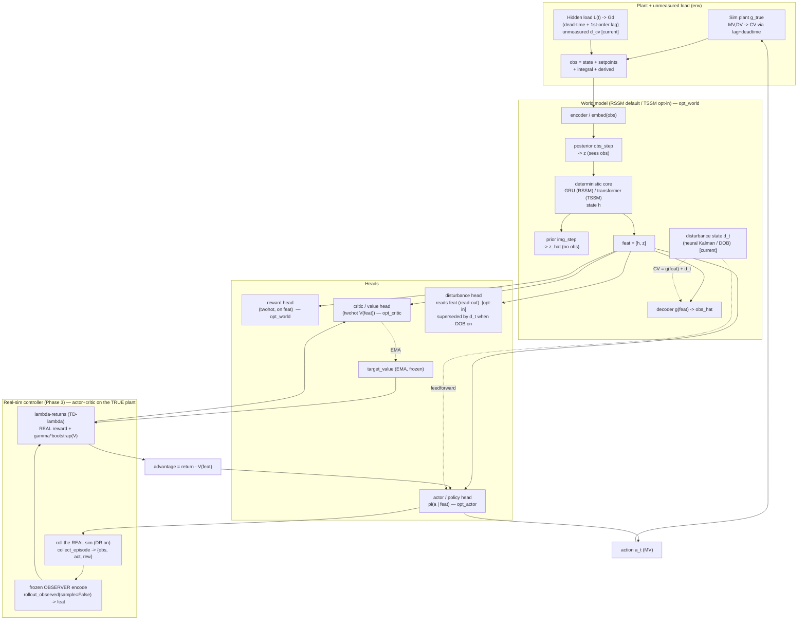
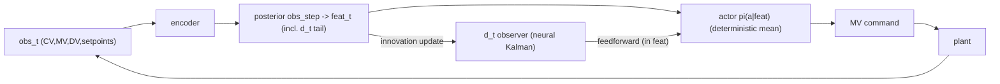
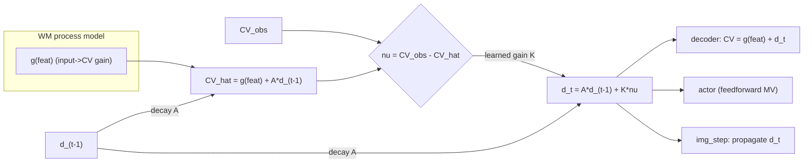

# neural-apc-mbrl — World-Model + Actor-Critic Architecture

Living architecture reference for the model-based APC controller. Keep this in
sync with the code when the data flow changes (it is part of the repo on
purpose). Backbone-agnostic: the **TSSM** (P77 env-free default; transformer
over the lookback) and **RSSM** (opt-out `DREAMER_WORLD_MODEL_TYPE=rssm`) are
duck-compatible — `TSSMState`
mirrors `RSSMState` (`.h`, `.z_logits`, `.z`, `.feat`, `.stoch_flat`) and both
expose `obs_step` / `img_step` / `decode` / `rollout_observed`, with
`feat = cat([h, stoch_flat])` and `decode(feat) → obs`.

Status legend: **[current]** = implemented & default · **[opt-in]** = implemented,
env-gated off · **[planned]** = designed, not yet built.

> **2026-09-03 CURRENT env-free recipe (test_sim first):** TSSM **deterministic**
> (P77 LIVE A/B; RSSM via `DREAMER_WORLD_MODEL_TYPE=rssm`) continuous latent, compile **eager**, **DOB on** (GAIN-ONLY cont; `d_t` is the
> unmeasured load), DC supervisor = **gain-match only** (isolation/ss-match
> **off**, P40 KEEP) + **rest-IC** (P45 PROMOTE) + settle **−1**. Actor =
> `_realsim_actor_critic_step`. `skip_invalid_p3=True`. P46/P47 σ-reset
> KEEP-AS-OVERRIDE (default False): opened entropy (−0.101) then yanked
> at unfreeze even with Adam log_std-row zero (P47 EXIT econ **−221 vs
> −121**, bang-bang 0.53). Do **not** promote `p3_reset_log_std`. P48
> EXIT (`run_p48_collectdv`): `stream_serve_step` **KEEP** as train/serve
> identity, **FALSIFIED as cascade lever** (ES @236; freeze last_ok **24**
> 0.81@DV vs live 0.89). P49 EXIT (`run_p49_wrapunlock`, `4ef9bcb`):
> wrap-unlock KEEP as lock hygiene; **FALSIFIED as cascade lever**
> (last_ok **82**; first P3 ent −0.283; val MV ×0.816/×0.830 DV
> ×0.867/×0.924 det_r 0.632 amp-dead; seed kpi **−714**; 0-vs-0 false
> all_pass from skipped scripted dist). P50 EXIT (`run_p50_bcmean`,
> `9cbf771`): `bc_mean_only=True`. Freeze last_ok **88** GAIN-READY
> **0.90@DV**. First P3 ent **−0.107** (μ-only opened σ). Unfreeze 169
> still yanked **−0.107→−0.268**. Val paired **−56 vs −104 BEATS**
> (first since P45); seed kpi **−74**. ES @286. μ-only KEEP as σ-open
> + val beat; **FALSIFIED as yank lever**. P51 EXIT
> (`run_p51_sglogstd`, `d6a4511`, 361 iters):
> `p3_stop_grad_log_std=True` KEEP as unfreeze-yank + non-sticky
> floor (147 ent HELD; dip −0.282 @315 recovered −0.106; ES
> p3_plateau not entropy_collapse); **FALSIFIED as cascade lever**
> (μ-rail logp_std 0.54→38 @147; val paired **−72 vs −111**, worse
> than P50 **−56 vs −104**; best.pt **161** during cascade).
> P52 EXIT (`run_p52_logpclip`, `d910ee2`, 209 iters):
> `p3_logp_clip=8` KEEP as delayed first-unfreeze bound
> (147 std **6.11** / actor **−0.77** vs P51 38 / −4.66);
> **FALSIFIED as cascade** (in-support μ-walk; val paired
> **−377 vs −87 FAIL**, 0/9; worse than P50 **−56 vs −104**
> and P51 **−72 vs −111**; best.pt **176** det **−634**).
> Gate @82 last-ok **78** MV **0.95** DV **0.84**. Default
> `p3_logp_clip=8` nats **per MV** (summed
> logp clamp `8×n_mv`; 1-MV identity). **P53 EXIT**
> (`run_p53_muratio`, `126f011`, 262 iters): PPO-style
> ratio clip vs a frozen unfreeze-μ snapshot
> (`p3_mu_ratio_clip=0.2`) KEEP as μ-walk limiter **and**
> cascade (paired **−13 vs −98 BEATS 9/9**; actor champion).
> ES @262 was H(σ_init) below a 0.20-nat floor margin
> (thr −0.083). **P54 EXIT** (`run_p54_esentband`, `f6739ac`, 446
> iters): ES floor **KEEP** as false-trip fix (`p3_plateau`; 0/310
> below −0.238) and **FALSIFIED as actor-econ lever** (paired **−26 vs
> −101** 9/9, worse than P53 −13/−98). Freeze-forever μ-ratio is a
> late-P3 ceiling (`clip_frac` 0.42→0.11). **P55 EXIT**
> (`run_p55_murefresh`, `b321d89`, 366 iters) **FALSIFIED**
> `p3_mu_ratio_refresh_iters=1`: recopy vs last-iter μ is a 20%/iter
> compounding walk. Unfreeze 147 logp_std 0.67→18.8@175 still 19.4@320
> / **64@366**; ema −170→−2163; rscale 1.91 KEEP. Val paired **−87 vs
> −78 FAIL 5/9**. **REVERT** env-free default **1→0**. Keep ε=0.2.
> Next GPU: P56 `DREAMER_P3_MU_RATIO_REFRESH=50` (A/B; not a default).
> **P56 EXIT** (`run_p56_muslow`, pid **110246**, sha `9d05866`, 476
> iters): N=50 **FALSIFIED as actor-econ lever**. No P55 walk
> (logp_std ~0.50–0.59 after recopy ~197; clip ~0.10). Extra P3 +
> recopy-inside-freeze-forever-ball is a no-op vs N=0 and **P54-class**
> val **−26 vs −112** (9/9; worse than P53 **−13 vs −98**). Gate
> **0.83@DV**; val MV ss/@H **×0.765 / ×0.754**, DV **×0.762 / ×0.790**,
> det_r **0.352**. rscale **2.26 KEEP**. Default refresh stays **0**.
> Rest-IC graph failed this pid (`t_wm` 124 s). Champion stays **P53**.
> Encode ``L`` default is lookback (P57 EXIT **REVERT**
> ``gain_match_rest_ic_len=0``; ``-1`` A/B last ``max(K, 2τ/sr)``).
> **P58 EXIT** lookback KEEP; paired **−6.24 vs −102** 9/9 **actor champion**.
> **P59 EXIT** collect/val CUDA-graph KEEP as speed / FALSIFIED as TM/econ
> (val MV ×0.876 DV ×0.840; paired −28 vs −117).
> **P60 EXIT** teacher Δu auto = `wm_tf_step_frac` KEEP as protocol /
> FALSIFIED as TM-closer-to-P26 (val MV ×0.849 DV ×0.767 det_r **−0.095**;
> paired −27 vs −112, loses to P58).
> **P61 EXIT** (`run_p61_clipdu`, pid **155682**, sha `c4ed6f3`, 336 iters):
> cube-clip **KEEP as protocol** / **FALSIFIED as TM-closer-to-P26 / actor-econ
> / storm-preventer**. Val MV **×0.911 / ×0.920** DV **×0.772 / ×0.833**
> det_r **0.153**. Paired **−23.53 vs −87.49** 9/9, loses to P58. Storm
> **2/2 @56–57**. Do **not** revert clip.
> **P62 EXIT** (`run_p62_heldcv`, pid **160203**, sha `6841f5c`, 441 iters):
> decode-CV late−early **KEEP as space** / **FALSIFIED as compounding/TM/econ**.
> Val MV **×0.806 / ×0.790** DV **×0.800 / ×0.815** det_r **0.364**.
> 1step→OL ×0.828 OL-vs-real **×0.785** (P61 ×0.809). Paired **−44.58 vs
> −112.66** 9/9, loses to P58/P61. P1 held **1.53e-4** vs overshoot **0.040**.
> **P63 EXIT** (`run_p63_olmag`, pid **165969**, sha `61cbdf9`, 79 iters):
> 1step→K FO magnitude **DISCARDED / REVERT**. Storm **2/2**, recon stuck
> ~0.5, GAIN_NOT_READY **9.75@MV**, P3 skipped. Do **not** score actor.
> Held-magnitude family **closed**. KEEP `out='obs'` late−early.
> **P64 EXIT** (`run_p64_p2amp`, pid **169231**, sha `9544451`, 401 iters):
> P2 Kalman amp = P3/val cap **KEEP as protocol + actor-econ**. Val MV
> **×0.927 / ×0.932** DV **×0.893 / ×0.962** (new DV champ). det_r **0.352**
> pred_std **0.608 vs 1.93**. Paired **−4.54 vs −94 BEATS 9/9** (beats P58).
> **PARTIAL as DOB-amp**. **FALSIFIED as det_r→P26**. P2 buffer stayed 100%
> P1-clean at the latch. **P66 EXIT** skip **REVERT**. **P65 EXIT** (`run_p65_p2flush`, pid **173526**,
> sha `b4ee586`, 515 iters): P1→P2 replay flush **REVERT / FALSIFIED**.
> Val MV **×0.830 / ×0.814** DV **×0.794 / ×0.844**. det_r **0.191**
> pred_std **0.518 vs 1.93**. Paired **−11.95 vs −139** 9/9, loses to P64.
> P2 starvation (buf 5→276). Dummy jsonl
> `wm_held_ol_ratio` **REMOVED**. `DREAMER_ACT_HIST_REQUIRED` **REMOVED**.
> Leftover P3 jsonl alias **writes** **REMOVED**; parsers now summarize
> `realsim_return_mean`. Stale `tools/run_nl_then_p09.sh` + p138/p136
> one-off probes **DISCARDED**.
> Champion **P64** econ / **P53** μ-ratio / **P26** MV ss / **P64** DV ss.
> **P66 EXIT** (`run_p66_dobvar`, pid **181468**, sha `38880f9`, 515 iters):
> per-seq `dob_ground` var-skip **REVERT / FALSIFIED**. Val MV **×0.766 /
> ×0.774** DV **×0.773 / ×0.814**. det_r **0.264** pred_std **0.252 vs 1.93**.
> Paired **−19.85 vs −104**, loses to P64. Third DOB-amp A/B. **P67 EXIT
> CAPPED GAIN_NOT_READY 0.80@DV** (`run_p67_gmatch4h`, pid **187753**):
> teacher K=220. Val MV **×1.348 / ×1.510** DV **×0.787 / ×1.005**.
> HEAD **REVERT** auto K to H. Do not settle=`wm_tf_horizon`. Do not
> teacher-K N+1. **P68 EXIT** (`run_p68_tmpre`, pid **193014**, sha
> `9c18daa`, 541 iters): rest-pre Huber **KEEP as protocol** /
> **FALSIFIED as TM-closer-to-P64 / compounding / actor-champ**. Val MV
> **×0.692 / ×0.725** DV **×0.792 / ×0.869**. 1step→OL **×0.787**
> OL-vs-real **×0.716**. det_r **0.535** pred_std **0.401 vs 1.93**.
> Paired **−3.90 vs −85.35 BEATS 9/9**. mv_viol **1.92** vs P64 0.33.
> Freeze last_ok **73 GAIN-READY 0.89@DV**. Champion stays **P64**.
> **P69 EXIT** (`run_p69_oltail`, pid **198448**, sha `256c889`,
> 76 iters): stop-grad OL tail **REVERT**. CAPPED **0.75@MV** last_ok
> **18**. Val MV **×0.383 / ×0.384** DV **×0.792 / ×0.828**. Actor
> INVALID. Window-extension family **closed**. **P70 EXIT**
> (`run_p70_cgainhold`, pid **204329**, sha `35af8cf`, 60 iters):
> hold-G **REVERT**. Storm 2/2 CAPPED **−0.60@MV** last_ok **2**.
> Val MV **+0.478 vs −0.32** rel_err **2.49**. Actor INVALID.
> **P71 EXIT** (`run_p71_nogainc`, pid **208659**, sha `5a16c67`,
> 93 iters): gain-c out of GRU **REVERT**. CAPPED **0.76@DV** last_ok
> **38**. Val MV **×1.089 / ×0.899** DV **×0.701 / ×0.759**. Actor
> INVALID. G-recurrence family **closed**. **P72 EXIT** G-in-GRU **KEEP
> as P71 REVERT** / **FALSIFIED as TM/compounding/champ** (freeze
> **GAIN-READY 0.87@DV** last_ok **15**; val MV **×0.647 / ×0.626**
> DV **×0.642 / ×0.641**; OL **×0.633**; paired **−22.71 vs −92.72**
> VALID 9/9, mv_viol **9.70**). Dummy `gain_match_ol_tail_*` jsonl
> **REMOVED**. Dummy `gmatch_ol_tail=0` banner **REMOVED**.
> **P73 EXIT** (`run_p73_olgpersist`, pid **214644**, sha `e09eb3d`,
> 515 iters): OL gain-c persist **KEEP as last_ok-81 hygiene** /
> **FALSIFIED as compounding / TM-pin / champ**. persist_rel **0.037
> @81**. Val MV **×0.722 / ×0.769** DV **×0.743 / ×0.835**. 1step→OL
> **×0.761** OL **×0.743**. det_r **0.630**. Paired **−4.91 vs −125**
> VALID 9/9. P69–P73 G-family **closed**. **P74 EXIT** decoder skip
> **REVERT** (`run_p74_gcvskip`, pid **221013**, 381 iters): freeze
> **GAIN-READY 0.81@MV**. Val MV **×0.809 / ×0.873** DV **×0.848 /
> ×0.941**. 1step→OL **×0.836**. det_r **0.074**. Paired **−48 vs
> −105**, mv_viol **20**. Skip rms stalled **0.00387** — teacher-pin
> no-op + DOB-shaped steal. Decoder-skip family **closed**. **P75 EXIT**
> FOPDT rise teacher **REVERT** (`run_p75_gmatchfo`, pid **230450**,
> 391 iters): GAIN-READY 0.84@MV. Val MV **×0.822 / ×0.815** DV
> **×0.838 / ×0.858**. 1step→OL **×0.803** OL **×0.799**. det_r
> **0.446**. Paired **−24.50 vs −84.89** VALID 8/9, mv_viol **1.50**.
> Rise mass 1.4% at K=H. FO family **closed**. Persist KEEP. Last-step
> DC Huber restored. **P76 EXIT** GRU z-bias **REVERT**
> (`run_p76_grubias`, pid **237453**, 148 iters): freeze **0.80@MV
> GAIN_NOT_READY**; val MV **×0.865 / ×1.004** DV **×0.819 / ×0.896**;
> 1step→OL **×0.770**; actor INVALID. Keep-h stalled conv. Do not
> GRU-bias N+1. **P77** env-free `world_model_type='tssm'`
> (LIVE P1 iter 50; probe50 H=1 r=+0.509 H=55 r=+0.273 conv=0
> gain_fid=0.389; recon best 0.007 ~2.5× P64; persist_rel 0.51;
> CPU @wm_best40 Markovian |Δ|=0.14 1step→OL ×0.077 — no live patch).
> Canonical jsonl `adv_action_corr`.
> `training_diagnostics` is
> 3×3 (logp_std / clip_frac / rtgt). P3 banner prints `logp`/`clip` and
> `skip this/cum` (`n_grad_skip_iter`).
> p136 `actor_kl_coef` **REMOVED**.
> `DREAMER_ACTOR_LOSS=pmpo` is a **false A/B** (`train()` refuses;
> dead `pmpo_loss`/`kl_to`/`pmpo_alpha`/`pmpo_beta` / prior-refresh knobs
> **REMOVED**). `_realsim` now logs
> `critic_mc_loss`. Do **not** promote
> `p3_reset_log_std`. Do not stack critic knobs. CUDA replay H2D
> reuses pinned host + GPU dest per slot. Rest-IC CUDA-graph:
> P55 pid capture failed (autocast
> cache) → eager T-loop. **P56 pid** warmup failed
> (`grad requires non-empty inputs` on a nested function with empty
> ``parameters()``). **P57 pid 116788 captured** ``N=6 T=55``
> (``t_wm`` median **99 s** vs P56 124 s). HEAD captures **before** the WM autocast loop
> (exit parent autocast, `cache_enabled=False`), **never captures
> in-loop**, and graphs `_RestICGraphModule` so RSSM
> `parameters` / `named_parameters` / `buffers` /
> `named_buffers` are the capture surface
> (`allow_unused_input=True`; overriding only `parameters()` left
> `named_parameters()` / `buffers()` empty). Transient VRAM skip
> does **not** pin `_rest_ic_cg_fail` (warmup retries once after
> `empty_cache`). Capture also zeros+syncs+gc and suppresses the
> AccumulateGrad stream-mismatch warn across capture **and** the
> GRU-grad canary; **P59:** keep the flag off until graph release so
> the first live WM backward does not print the leftover UserWarning
> (P58 restored after canary). Rest-IC FD `a_seq` is
> cached; encoder-var / Huber MV–DV jsonl run on the last logged
> inner only; P1 H2D is `obs`/`act` (and `dist` only if
> `_wm_need_dist_target`) except MTP last. P2/P3 skip leftover
> `cont`; P3 also skips `dist` (`_replay_h2d_keys`; frozen observer
> re-encodes from `obs`; P2 still copies `dist` for dob-ground).
> RSSM/TSSM T/K loops `_time_unbind` once; Stage-1 `d_t≡0` reuses
> `cached_zeros_btd`. Full-T encode stacks `h/z/(c)/(dv)` then one
> cat (not T cats; `z` flatten-after-stack); overshoot `out='obs'` is one `decode` after K.
> **P57 EXIT:** GAIN-READY **0.89@DV** @82;
> last_ok **82**; graph **captured** then **released**; `t_wm` P1
> **99 s** / P2 **22.6 s**. Unfreeze 147 ent **−0.101 HELD**. rscale
> **2.35 KEEP**. Val MV **×0.715 / ×0.712** DV **×0.780 / ×0.836**
> det_r **0.285**. Paired **−14 vs −97** 9/9. Encode L **FALSIFIED**
> as DC-gain; default **0** lookback. Replay `sample(keys=)` skips
> leftover `cont`; P3 actor skips `dist`+`expert`; TD-λ is a
> reverse-`cumsum`. HEAD
> also **releases** the graph at g freeze (P2/P3 skip gain-match).
> **P58 EXIT** (`run_p58_resticlb`): lookback KEEP; **actor champion**
> paired **−6.24 vs −102** 9/9. Val MV ×0.806/×0.816 DV ×0.669/×0.720
> compounding ×0.675. **P59 EXIT** (`run_p59_headserve`): collect/val
> CUDA-graph **KEEP as speed** / **FALSIFIED as TM/econ**. Val MV
> ×0.876/×0.874 DV ×0.840/×0.890. Paired **−28 vs −117**, loses to
> P58. Teacher Δu=1 vs TM 0.4. **P60 EXIT** (`run_p60_tmstep`, pid
> **144896**): teacher Δu auto = `wm_tf_step_frac` **0.4**. KEEP as protocol /
> FALSIFIED as TM. Val MV ×0.849 DV ×0.767 det_r **−0.095**. Paired
> **−27 vs −112**. **P61 EXIT** clip KEEP as protocol / FALSIFIED as TM
> (val MV ×0.911 DV ×0.772; paired −24 vs −87). **P62 EXIT** held decode-CV
> KEEP as space / FALSIFIED as compounding (val MV ×0.806 DV ×0.800
> OL-vs-real ×0.785; paired −45 vs −113). **P63 EXIT** FO magnitude
> **REVERT** (GAIN_NOT_READY; family closed). **P64 EXIT** P2 Kalman amp = P3
> cap KEEP as protocol + actor-econ (paired **−4.54 vs −94**). **P65 EXIT**
> P1→P2 replay flush **REVERT** (val pred_std 0.518 vs P64 0.608; paired
> −12 vs −4.54). **P66 EXIT** per-seq `dob_ground` var-skip **REVERT /
> FALSIFIED** (pred_std 0.252 vs P64 0.608; paired −19.85 vs −4.54).
> **P67 EXIT** (`run_p67_gmatch4h`, pid **187753**, 158 iters): teacher
> K=220 **CAPPED 0.80@DV**. Val MV **×1.348 / ×1.510** DV **×0.787 /
> ×1.005**. OL-vs-real **×0.814**. det_r **0.026**. Actor INVALID.
> HEAD **REVERT** auto K to control H. Do not teacher-K N+1. **P68 EXIT**
> rest-pre Huber **KEEP as protocol** / **FALSIFIED as TM/compounding/champ**.
> Rest-pre skips the unused held-K `img_rollout` row. **P69 EXIT**
> stop-grad OL tail **REVERT** (TBPTT-on-DC; CAPPED 0.75@MV). **P70 EXIT**
> hold-G **REVERT** (CAPPED −0.60@MV). **P71 EXIT** gain-c out of GRU
> **REVERT** (CAPPED 0.76@DV). **P72 EXIT** G-in-GRU KEEP as revert /
> FALSIFIED as TM (val MV ×0.647 OL ×0.633; paired −22.71 VALID).
> **P73 EXIT** OL persist KEEP as last_ok-81 hygiene / **FALSIFIED
> as compounding** (val 1step→OL ×0.761 OL ×0.743; persist_rel 0.037).
> **P74 EXIT** decoder skip **REVERT** (`run_p74_gcvskip`, 381 iters):
> val MV ×0.809 det_r **0.074** mv_viol **20**. Teacher-pin no-op +
> DOB steal. **P75 EXIT** FOPDT rise **REVERT** (`run_p75_gmatchfo`,
> 391 iters): val MV ×0.822 1step→OL ×0.803 paired −24.50 vs −84.89
> 8/9. FO family closed. **P76 EXIT** GRU z-bias **REVERT**
> (`run_p76_grubias`, 148 iters): freeze 0.80@MV GAIN_NOT_READY; val
> MV ×0.865 1step→OL ×0.770; actor INVALID. **P77** TSSM default.
> Dummy ol-tail jsonl **REMOVED**.
> `derive_horizon` / sim `reset()` now
> `horizon_formula_knobs()` / `ic_randomization_knobs()` (TrainConfig
> 4.0/120 / ON/0.6). `derive_episode_length` now
> `episode_formula_knobs()` (TrainConfig 20 / 500 / 4000; smoke green).
> GPU-calib probe reads
> TrainConfig via `gpu_probe_knobs()` (identity 1.30/0.80/512; BO no
> longer silently uses WM-only 1.0). Missing SysID keys do **not**
> invent τ=50 s / θ=5 s. APCEnv operator-limit schedule
> (change counts 1–2, ramp/warmup 0.10, strata 3, inside-margin 0.05)
> is TrainConfig + `ENV_OVERRIDES`; `auto_derive` jitter is **0.15 / 0.20**.
> Step-settle `|Δu|` 0.20/0.60 + prefix 0.05/0.20, `shaping_safe_margin_frac=0.25`,
> PRBS-seg sentinel 0, `wm_ss_match_window_frac=0.34` are in `ENV_OVERRIDES`.
> Do **not** switch APCEnv to `auto_derive`. Reward-engine
> leftovers (`objective_integral_*` / `obj_auto_*` / clip sentinel `<0` =
> adaptive) are TrainConfig + `ENV_OVERRIDES`. Do not promote other plants
> until linear observer+actor are healthy. Eval TM protocol (`wm_tf_*`) and
> val-suite gates, horizon formula (`horizon_settle_n_tau` /
> `horizon_max`), IC randomization, GPU-calib `wm_overhead`, derived
> observables, and **noise / hidden-load schedule** knobs
> (`process_noise_amp_ramp`, `hidden_dist_*`, `disturbance_prob_*`) plus
> GPU-calib budget (`gpu_target_util` / `gpu_max_bs` / `DREAMER_BATCH_SIZE`)
> and plant-SNR (`sim_noise_adaptive` / `sim_ou_*` / `sim_meas_noise_*`)
> plus wrapper seed/jitter/DR (`sim_noise_enabled` / `sim_noise_jitter_pct` /
> `sim_domain_randomization` / `sim_param_randomization_pct` sentinel −1=auto)
> and operator-event schedule (`disturbance_authority_frac` /
> `disturbance_recovery_frac` / `disturbance_settle_steps` /
> `disturbance_quiet_frac`; leftover `AGENT_DISTURBANCE_*`)
> plus expert move-law (`expert_move_frac` / `backoff_frac` / …)
> and CLI extras (`POLICY_*` /
> `GRAD_CLIP` / seed counts / plant-derived arch) that `single_run`
> used to drop are TrainConfig + `ENV_OVERRIDES`. Val/diag pin
> `hidden_dist_spread=True` via `force_val_hidden_dist_spread` (no leftover
> `DREAMER_HIDDEN_DIST_SPREAD` poke).

> **2026-06-11 (status 2026-08):** the neural-Kalman-filter / DOB disturbance
> observer (§3) is implemented in both backbones and is **default ON**
> (`TrainConfig.dob_enabled=True`; opt out `DREAMER_DOB_ENABLED=0`). Exp A
> (p113) showed the unmeasured load was an omitted variable attenuating the
> gain (hidden disturbance OFF recovered WM gain 0.36→0.18 and autoencoder
> real→posterior 0.77→0.94) — exactly what the DOB de-confounds.

> **2026-06-22 [SUPERSEDED 2026-08-18 — see below]:** the **continuous
> gain+disturbance latent (§3b, C3)** supersedes the DOB as the default direction
> (`DREAMER_CONT_LATENT_ENABLED=1`). One Gaussian latent fixes BOTH the
> subdominant DV-gain categorical-attenuation bias (≈0.85, via the C(1)
> gain-match) AND the unmeasured-disturbance estimate (an inherent amortized
> Kalman, **no DOB**). The DOB stays in the code as a one-flag fallback
> (`DREAMER_DOB_ENABLED=1`) until the cont disturbance is verified to recover
> (detrended r ≥ the DOB's 0.354). First run: p137. *(The cont **disturbance**
> channel FAILED to recover — p137–p141 held-out r ≤ 0 — and was reverted at
> p142; the cont latent now keeps only the **gain** block. See the 2026-08-18
> note.)*

> **2026-07-07 — neural-apc-mbrl2 fork (REAL-SIM controller):** the actor is no
> longer trained in WM imagination. **Imagination is deleted** (`imagination_step`
> / `_imagination_step_rssm`, ~880 lines removed). The WM (RSSM) + DOB are now a
> **frozen OBSERVER only**; the **actor-critic trains on λ-returns from REAL
> rollouts of the true simulator** (`_realsim_actor_critic_step`) with **domain
> randomisation** enabled at P3 (`set_domain_randomization(True)`). This removes
> the objective-mismatch / model-exploitation that drove the p106→p143 actor
> failures, grounds the critic in **real returns** (an MC anchor over full real
> episodes + a diverse-replay critic keep the value head well-conditioned; no
> `return_scale` cascade), and keeps DreamerV3's scale-invariant normalisation
> (symlog/twohot/percentile ⇒ fixed hyperparameters across sims). The
> imagination-specific parts of §1 (the Phase-3 rollout, imagination gain-rand)
> are **superseded**; the WM losses (recon/KL/DOB + overshoot/held-rollout) are
> KEPT — they train the OBSERVER, not the deleted imagination actor.
> `actor_train_source='realsim'` (default).

> **2026-08-18 — observer sharpened (GAIN + DISTURBANCE).** Terminology note: the
> RSSM is still a **world model** (a learned plant-dynamics model `g`/`f`; the
> `wm_*` diagnostics show it *imagining* open-loop step responses to measure its
> fidelity). Its **role** in this fork is a **frozen OBSERVER** (state +
> disturbance estimator) that the real-rollout actor-critic reads. Three updates:
> **(1) DOB reinstated as the default disturbance estimator (p142).** The
> continuous *disturbance* latent (2026-06-22) was dropped — it competed with the
> DOB for the same CV innovation (the gain↔disturbance identifiability confound)
> and never recovered (p137–p141 held-out r ≤ 0). The cont latent now keeps ONLY
> the **gain** block (the C(1) gain-match de-confounder); the neural-Kalman
> **DOB `d_t` owns the unmeasured load** (`TrainConfig.dob_enabled=True` auto-selects the
> GAIN-ONLY cont latent). **(2) Option 1 — symmetric per-input steady-state
> DC-gain ID (p18).** A first-class, input-symmetric `wm_ss_match` DC-gain
> objective (settledness-gated via `wm_ss_match_settle_var`, MV & DV identical)
> makes the observer's gain **bias-free** on the linear plant (MV ×0.92, DV ×1.14,
> ss ≈ at-horizon ⇒ stable open-loop). **(3) P19 — KalmanNet-style DOB grounding**
> (`DREAMER_DOB_GROUND_COEF`, §3). P18 showed the DOB *under-tracked* the load
> (d_t vs true r=0.42, ~0.3× amplitude): in Stage-2 the recon innovation alone
> under-drives `d_t` (the slow load is a small share of the recon MSE) and
> `dob_reg` opposes it, so imagination + the critic stayed disturbance-blind and
> the actor collapsed below the open-loop baseline. Grounding adds a direct
> `dob_ground_coef · ‖d_t − true_load‖²` (unit-matched via the running CV
> obs-norm std) that tunes the Kalman `A,K` to TRACK the load — the structural fix
> for the manual `dob_gain_init` amplitude tuning. `dob_reg_coef → 0` when
> grounding is on. First run: p19 (`run_p19_dobground`).

> **2026-08-24 — P25 RCA / P26 observer fixes (branch `grok`).** Two silent
> bugs made the observer look trained while staying biased. **(1) TBPTT killed
> DC-gain.** P24's `st.detach()` every 16 of K=55 on the gain-match *asymptote*
> roll left the forward Huber loss tiny but cut the gradient through the rise
> that sets transfer-matrix gain (P25 freeze MV ×0.74 / @H ×0.60). Gain-match
> now runs **full BPTT** (explosion defence = Huber + `wm_grad_skip_norm`);
> isolation may still TBPTT **`h` only** (`keep_c=True`) and **never inside the
> SS-match settle window** (applied *between* `img_rollout` chunks so
> compile-on fuses each chunk; eager `img_step` count unchanged). **(2) DOB grounding was dead code** whenever the
> DOB replaced the read-out head: `disturbance_head_dim` is forced to 0, the
> replay buffer stored `n_dist=0`, `batch['dist']` was missing, and
> `dob_ground` was identically 0 for every P2 iter of P19 *and* P25. Buffer
> width is now `n_cv` whenever DOB or `dob_ground_coef>0` (`_replay_n_dist`).
> Stage 2 (critic ensemble + freeze `return_scale`) waits until the P1→P2
> gain-probe is READY.

> **2026-08-25 — P26 verdict / P27 FAIL / P28 (branch `cursor`).** Observer GAIN
> was healthy on P26 (MV ss/@H ×0.97/×0.88) with residual DV ss ×0.87. **P27
> aborted in P1** (`grad_skip_storm` @iter 50, `wm_grad_norm` 6e12, recon
> 0.004→0.50, 42 skips). Relative Huber (`gain_match_relative=1`) over-weighted
> the small DV target and exploded full-BPTT; P2/P3 never ran. Validation
> `final.pt` is the **P1 expert-BC policy** (econ −59 vs baseline −77 looks
> “better” than P26’s cascaded RL, but `critic_r`/`reward_r` are NaN and MV
> gain is ×1.95). **P28:** revert relative gain-match to absolute (P26
> observer); keep min-of-2 critics + freeze `return_scale` (still untested);
> on a P1 skip-storm restore `wm_best.pt`, reset AdamW, cap P1 and continue
> to Stage 2 instead of aborting. **P28 follow-up:** the original cap only
> zeroed `p1_ext_steps`, which re-opened the P1 quality-gate extension and
> would re-run exploding full-BPTT gain-match. Recovery now also closes
> `p1_gate_max_ext_steps` (`_force_p1_cap_at`) so the next iter is Stage 2.
> **P28 follow-up 2:** closing the extension cap was not enough — the
> curriculum freeze latched at *loop start*, so the first P2 train step
> still had `g` trainable (one extra full-BPTT gain-match on the restored
> weights). Freeze/DOB now re-apply on the same iter as `current_phase`
> changes. Isolation TBPTT stride is sim-adaptive (`max(8, round(K/3.5))`,
> 16-of-55 on test_sim); Huber β is not re-read from env on the hot path
> (that undid `<=0` auto-median).
> **P28 follow-up 3:** skip-storm recovery used to restore fidelity-peak
> `wm_best.pt` (gain-blind EMA of correlation + std-ratio). P27's last
> healthy observer was iter 49; an early lucky `wm_best` would have
> discarded that late-P1 excitation. Recovery now keeps an in-memory
> last-ok snapshot on every skip-free P1 iter whose recon is within
> `skip_storm_last_ok_recon_ratio` (default 5×, unitless) of the best
> recon, and restores that first (writes `wm_last_ok.pt` only if a
> storm fires). Fallback is still `wm_best`. Summary
> records `actor_experiment_valid=False` when the freeze is
> `GAIN_NOT_READY` or skip-storm fell back to `wm_best`. Default
> `skip_invalid_p3=True` then **skips P3** (`[p3-skip]`,
> `early_stop_reason=p3_skipped_invalid_observer`); observer
> validation still runs on `final.pt`. P29 hid GAIN_NOT_READY
> behind a later `not_plateaued` cap (no freeze-time probe) so P3
> still started — the cap path now always re-probes gain.
> Opt out `DREAMER_SKIP_INVALID_P3=0`.
> **P28 follow-up 4:** last-ok restore was still undone on the next
> iter. At the time, default `DREAMER_WM_BEST_RESTORE_AT_P2=1` reloaded the
> fidelity-peak `wm_best.pt` at the P1→P2 boundary (healthy-P1 win,
> p124). **P28 GPU reverted that default to False** (see below). After a skip-storm the next iter *is* that boundary, so
> last-ok was overwritten by the same gain-blind spike follow-up 3
> exists to avoid. Recovery now skips the P1→P2 (and P2→P3) wm_best
> reload when `skip_storm_p1_recovered`. Healthy P1 still restores
> only if that knob is opted back on.
> **2026-08-26 — P28 GPU VERDICT / P29 / env-free latent drop.** `run_p28_absgain_qens` (@ a7941be,
> before follow-ups 1–14) restored gain-blind `wm_best` iter 60 on a
> *healthy* P1 (0 skip-storms). Val MV ss/@H ×0.52/×0.48 vs P26 ×0.97/×0.88.
> Follow-up 4 (skip restore only after skip-storm) would not have stopped
> this. **P29:** `wm_best_restore_at_p2` default **False** — freeze
> end-of-P1 `g`. Opt in with `DREAMER_WM_BEST_RESTORE_AT_P2=1`. Freeze
> `return_scale` did pin 2.29 (KEEP) but the P28 actor experiment is
> **invalid** (GAIN_NOT_READY).
> **P29 live (confounded):** env-free launch dropped
> `DREAMER_RSSM_LATENT_TYPE=deterministic` (P26/P28 env, never a
> TrainConfig default). P29 is **categorical** (`kl_loss` pinned at
> free_bits, `joint_embed_loss≡0`, recon 0.50→0.28 by P1 iter 30 vs
> P28 0.004; recon spiked 0.18→0.65 at iter 49 after buffer wrap).
> Not a skip-restore A/B. **Default is now `deterministic`.**
> `z_dim=32` / `zrank/1024` does **not** distinguish the two (same
> stoch_flat width). Read `kl_loss` vs `joint_embed_loss` or the
> train-start `latent=` banner. After gain-match resolve, train.py
> rewrites `run_plan.json → config` and prints `[resolved-cfg]` so
> env-free audits see auto-enabled `gain_match` / `dob_ground`,
> not the dataclass sentinels. Isolation is **not** auto-enabled
> (P40). `single_run` / `train()` pin `evaluation.validate` + TM/diag
> modules at launch so a mid-run HEAD leftover cannot race the val
> import (P47 `resolve_wm_tf_knobs`, P48 `alloc_pinned_obs_host`).
> Identified plant `τ`/`θ` live on TrainConfig
> (`identified_tau_dominant` / `identified_dead_time`); APCEnv
> caches them. P29's on-disk plan is the
> *pre-rewrite* dump (`rssm_latent_type=categorical`).
> **Compile leftover (same class):** `TrainConfig.compile_mode=''` was
> documented off, but `build_model` treated empty as default-on unless
> `DREAMER_COMPILE=0`. Env-free P29 compiled; P26/P28 (no compile
> banner) were eager. Default is now **eager**; opt in
> `DREAMER_COMPILE=1` or `DREAMER_COMPILE_MODE=default` (both now in
> `ENV_OVERRIDES` — `single_run` used to silently drop `DREAMER_COMPILE_MODE`).
> Train-start / `[resolved-cfg]` print `compile=`. Compile-on caps
> inductor worker threads to `min(4, ncpu/4)` so the CPU sim is not
> starved (P29: 20 workers on 20 cores, collect 22.6 s vs P28 17.6 s).
> **P29 EXIT=0 (2026-08-26):** categorical leftover + compile-on. Val MV
> ss/@H ×1.10/×1.23, DV ×0.56/×0.65 (autoencoder), det_r 0.725 (amplitude
> poor). Skip-restore DID fire — still not an A/B. Actor INVALID
> (`actor_experiment_valid` bookkeeping True; entropy-collapse @234; econ
> −411 vs −83). Freeze `return_scale` 1.48→4.85 (KEEP). HEAD already has
> deterministic + eager + `skip_invalid_p3`. **P30 LIVE** (`run_p30_deteager`,
> HEAD `2f0aec9`, 2026-08-26 16:01): env-free CUDA only. Train-start
> `latent=deterministic compile=eager skip_invalid_p3=True device=cuda bs=128`.
> `[resolved-cfg]` same + `gain_match=1 isolation=1 ss_match=3 n_critics=2
> rs_freeze=True restore_p2=False`. No leftover `[env-override]`, no
> `torch.compile` banner. Validation now logs `wm_dv_gain_*` so MV-only
> `wm_gain_pass` cannot hide a biased DV. HEAD also emits
> `wm_observer_gain_pass` / `wm_observer_gain_healthy` (MV AND DV) so
> the printed observer verdict is not MV-only. **P30 P1 iter 17 (2026-08-26 16:55):**
> recon 0.0098, `kl=0`, `jemb=0.036`, alive 1024, skip 0 — tracking P26/P28
> (not P29 leftover). GPU occupied; no second job. HEAD eager-path opt
> (batched isolation decode + vectorized overshoot MSE) is for the *next*
> launch; the live process is still `2f0aec9`.
> **P30 EXIT (2026-08-26 ~17:36):** skip-storm @iter 19 restored last-ok
> (KEEP — P2 recon 0.0125) then **capped P1 at iter 18**, throwing away
> remaining original P1. Cap-time DC 1.44@MV. P2 `wm_fidelity_degradation`
> then killed DOB after ~40 iters (g frozen; first P2 probe cannot
> improve). Val MV mean ×1.88 (median ~×1.06 + OP outlier); DV ×0.77;
> det_r 0.05. Actor never ran (`skip_invalid_p3`). **P31:** first
> skip-storm **continues original P1** (`skip_storm_p1_cap_after=2`);
> storm 1 keeps the quality-gate extension (P32 CAPPED 0.71@DV when
> it was closed); storm 2 still `_force_p1_cap_at`. Storm-time
> GAIN_NOT_READY does not stick if P1 continues. Fidelity ES suppressed
> while `_dynamics_g_trainable` is false.
> **P31 EXIT (2026-08-26 23:23, 151 iters):** storm_cap=2 KEEP (healthy
> P1 to iter 94; no skip-storm). Iter 95 detonated (recon 0.71, gnorm 66,
> skip 2→3). CAPPED froze exploded g — val MV ×1.35, DV ×0.11, det_r
> 0.11. `[p3-skip]` KEEP. **P32** (`run_p32_detfreeze`): P1→P2 restores
> last-ok when freeze recon is detonated vs last-ok best (same 5×
> ratio); re-probes gain. Also batched gain-match FD, numpy P1/P2
> collect, vectorized DOB Kalman, relative Huber **removed**.
> **P32 EXIT (2026-08-27 03:22, `run_p32_detfreeze`, 129 iters):**
> skip-storm 1/2 @iter 53 KEEP. P1→P2 CAPPED GAIN_NOT_READY 0.71@DV
> (healthy recon 0.0026; continue closed extension). Val MV ss/@H
> ×1.088/×1.098, DV ×0.675/×0.754, det_r 0.109. `[p3-skip]` KEEP.
> **P33 EXIT (2026-08-27 08:15, `run_p33_keepext`, 151 iters):**
> keep-ext **used** (iter 75/85 EXTEND, iter 97 CAPPED after 175924).
> No skip-storm. Val MV ss/@H ×1.083/×1.093, DV ×0.660/×0.770,
> det_r 0.398 (amplitude still dead). `[p3-skip]` KEEP. Keep-ext KEEP
> as mechanism, **FALSIFIED as DV lever**. Abs isolation drowns DV
> (|tgt| 2.82 vs 0.49). Extra P1 cannot pin DV.
> **P36 EXIT (2026-08-27 11:44, `run_p36_isoinpscale`, 61 iters):**
> per-input `|G|²` fired (`tgt_scale=1`, scale_ratio 20–33) but inv-var
> **DISCARDED**: iso 0.125 vs P33 1.69, gmatch stuck 1.21, storm 2/2
> @iter 7, val MV ×0.91 DV ×0.004 det_r 0.076. `[p3-skip]`. Same class
> as P27 relative Huber (33× DV isolation grad). Abs isolation is the
> only path (inv-var A/B **REMOVED**, same as relative Huber). Do not
> try another isolation reweight. P37 EXIT (`run_p37_isoabs`): val MV
> ×0.98 DV ×0.69 det_r 0.37 `[p3-skip]`. Abs isolation KEEP as P1 form;
> FALSIFIED as DV pin. Next GPU: env-free P38 `run_p38_isodcv`.
> **P28 follow-up 6 (no GPU this session):** inject **N** was a raw
> episode count (const 5 / step-test 2 / DV-PRBS 2 / expert 3). That is
> one 1-MV+1-DV shot. `_resolve_inject_cadence` now also sets
> `max(sentinel, f(n_mv,n_dv))` so distillation (4 MV + 1 DV) injects
> 5/5/4/4. test_sim stays 5/2/2/3. **Also:** `training.train._cfg_from_env`
> now applies the shared `ENV_OVERRIDES` whitelist (it had silently
> dropped 130+ knobs including skip-storm / aux TBPTT / `n_critics`).
> Cascade / grad-skip early-stop env-vars were missing from the
> whitelist entirely (ignored by `single_run`).
> **P28 follow-up 7 (no GPU this session):** isolation settle was a
> flat 24 (all MVs PRBS'd together, all DVs swept together) and the
> isolation ring-buffer cap was 48 — MIMO wrap-killed per-channel
> settle. `wm_isolation_settle_episodes` is now **per isolated
> input** (test_sim 24+24 / cap 48 unchanged). Distillation 4+1
> emits 96+24 and the cap grows to 120. Long-hold MV settle holds
> every other MV, suppresses curriculum DV + hidden OU, and DV
> settle isolates one DV channel.
> **P28 follow-up 8 (no GPU this session):** isolation_buf still mixed
> MIMO PRBS + all-DV PRBS with settle. Follow-up 7 sized the cap
> `max(baseline+dv_prbs+8, settle)` so dataclass test_sim stayed 48,
> but `auto_tune_seed_buffer` raises baseline ~16→26 → cap 58, and
> wrap kept ~10 confounded all-DV episodes in front of the 48 settle
> (errors-in-variables / gain↔disturbance on `wm_ss_match`). Cap is
> now settle-only; ordinary PRBS stays in the main replay buffer.
> Long-hold settle also uses P89 `clean_steady_seeds` (process OU +
> measurement noise off) — const-action/step-settle already did;
> isolation settle is the buffer that actually trains DC-gain.
> **P28 follow-up 9 (no GPU this session):** follow-up 8 still
> PRBS-stepped *inside* each settle episode (seg capped at T/4 → ~11
> holds of 2K on test_sim) and dithered the isolated MV with
> `baseline_seed_std`, and wired `_st_levels` to *other* MVs (`hold_level`,
> a no-op on test_sim n_mv=1). Random `seq_len` windows from
> `isolation_buf` straddled those steps (~half) so `wm_ss_match`'s
> `settle_var` gate starved the DC-gain term. Isolation settle is now a
> **whole-episode constant hold** at the stratified `isolated_level`
> (`action_std=0`, others at 0). DV settle is one step at t=0 to
> `isolated_level × (span/2)` (MV-action units; follow-up 10 dropped the
> extra `dv_prbs_op_frac` shrink), MV held at 0.
> **P28 follow-up 10 (no GPU this session):** follow-up 9 reused
> `dv_prbs_op_frac` as the DV isolation amplitude (`delta = isolated_level
> × op_frac × span/2`). Isolation linspace is already in
> `[-constant_action_seed_op_band, +…]` like the isolated MV, so DV steps
> were 0.8× smaller than the matching MV action → smaller |ΔCV| →
> absolute isolation/ss-match MSE under-trained DV (same family as
> abs-Huber on unequal |tgt|). Isolation DV step is now MV-action-
> isomorphic (`±1 ↔ ±half-span`). Isolation sample windows are
> `max(seq_len, K+1)` so a slow plant with H > seq_len still reaches SS
> (test_sim seq_len ≥ H unchanged). Isolation extra unroll is skipped
> when `g` is frozen (DOB curriculum P2 — dead hot-path forward).
> **P34/P35/P36:** even with isomorphic |Δu|, WM-norm |ΔCV| still differs
> by ~|G| (test_sim gain-match |tgt| 2.82 vs 0.49). Isolation inv-var
> (`wm_isolation_var_norm`) tried to equalize that and **failed three
> formulas** (P34 explode, P35 quiet-hold, P36 33× DV skip-storm).
> Abs MSE is the only path (A/B **REMOVED**). Default
> `wm_isolation_dcv_match` scales isolation **excitation**
> `Δu_i ∝ 1/|G_i|` then clips `level*scale` to ±1. Scale is
> **floored at 1.0** so the strong-|G| teacher stays at op-band.
> Logged `scale` is a **multiplier** on
> `isolated_level ∈ [−op_band,+op_band]`; applied edge |Δu| is
> `min(1, op_band·scale)` (`run_plan.isolation_dcv_scales.edge_du_*`).
> Span audit (no scale change): `g_ratio`, `smax=1/op_band`,
> `equalize_possible` (False on test_sim with floor 1.0: ratio ~5.8 >
> 1.67). P38 EXIT (`run_p38_isodcv`, **no floor**, 102 iters): MV scale 0.317 →
> edge |Δu| **0.19** (P37 0.60); DV scale 1.67 → edge |Δu| **1.0**.
> Match-at-`g_min` starved MV isolation SNR. Storm **1/2 @iter 45**
> (last-ok 13) then **2/2 @iter 48** CAPPED GAIN_NOT_READY **0.01@DV**
> (MV 1.12); gmatch stuck **1.30**; val MV ss/@H **×1.253 / ×1.293**,
> DV **×0.007 / ×0.007**, det_r **0.428** amp-dead, `[p3-skip]`.
> **FALSIFIED**. HEAD/P39 floor keeps MV edge |Δu|=0.60 and still
> boosts DV to the cube. P39 EXIT (`run_p39_isodcvfloor`, 151 iters):
> `[resolved-cfg] min_scale=1.0 edge_du 0.60/1.0`. Storm **1/2 @iter 53**
> recovered, extension kept. Iter 75/85 EXTEND 0.71 then 0.69@DV.
> Extra-P1 **did not detonate**. Iter 97 CAPPED **0.70@DV** (MV 1.00).
> Val MV ss/@H **×0.954 / ×0.954**, DV **×0.679 / ×0.785**, det_r
> **0.326** (amp dead: pred_std 0.156 vs true 1.93), `[p3-skip]`.
> Cube-boost **FALSIFIED as DV pin**. Floor KEEP as P1 form when
> isolation is on. **Structural:** `|G_max|/|G_min| > 1/op_band` cannot
> equalize |ΔCV| without shrinking the strong teacher (P38) or exceeding
> the cube. Floor is `wm_isolation_dcv_min_scale=1.0`.
> **P40 EXIT** (`run_p40_gmatchonly`, `73a5116`, 158 iters): isolation/ss-match
> **off** env-free. Storm 1/2 @65. Iter 82 EXTEND `not_plateaued` 6.541
> (gain-probe skipped). Extra-P1 @84; last_ok overwrote 83→104.
> Iter 104 CAPPED **0.75@DV** (MV 1.01). Val MV ss/@H **×0.995 / ×0.964**,
> DV **×0.723 / ×0.743**, det_r **0.490** (pred_std 0.246 vs true 1.93)
> `[p3-skip]`. Isolation-off **KEEP** as env-free default; **FALSIFIED as
> DV pin** (not P26 ×0.87). P26 `run_plan` isolation=0 was the pre-rewrite
> dump (jsonl iso 1.44). Gain-match is the DC supervisor. Opt in
> `DREAMER_WM_INPUT_ISOLATION_COEF`. Isolated-settle seed skipped when off.
> **P41 EXIT** (`run_p41_recentfloor`, `acb8a7b`, 158 iters): recent-floor
> **KEEP as mechanism** (gain-probe at 82, 94, and cap-time). CAPPED
> **GAIN_NOT_READY 0.74@DV** (MV 1.02; extra P1 0.76→0.74 FALSIFIED as
> DV lever). Val MV ss/@H **×0.986 / ×0.973**, DV **×0.700 / ×0.775**,
> det_r **0.079** / R² 0.006 (pred_std 0.196 vs true 1.93; P40 det_r
> **0.490**). `[p3-skip]`. Actor INVALID. Isolation-off KEEP as env-free
> default. Freeze last_ok **104** (overwrite 56→64 then extra-P1);
> detonated-freeze missed 56. **FALSIFIED as DV pin.**
> **P48 EXIT freeze:** original-P1 wrap lock at iter 24 never unlocked
> after recon recovered; freeze restored 24 (0.81@DV) vs live 0.89@DV.
> P49 LIVE P2: skip-storm 1/2 unlocked last-ok (**82** freeze ≈ live
> gate); wrap-recovery unlock still untested. Extra-P1 recovered basin stays
> locked (P40). Do not raise lock_ratio.
> Gain-match `img_rollout(..., last_only=True, out='obs')`. jsonl emits
> `wm_score_ema*` and isolation/ss keys as 0 when teacher off.
> `[resolved-cfg]` prints `iso_dcv=off` when the teacher is off.
> **P42 EXIT** (`run_p42_lastoklock`, launch `72f7b48`, 158 iters,
> `[p3-skip]`): last-ok **locks** after a silent recon spike
> (`skip_storm_last_ok_lock_ratio=20`, recon-only). Spike iter **67**
> locked snapshot **66**. Freeze restored 66; freeze probe **GAIN_NOT_READY
> 0.75@DV** (MV 1.19). Val MV ss/@H **×1.179 / ×1.161**, DV **×0.737 /
> ×0.804**, det_r **0.124** / R² 0.013 (pred_std 0.164 vs true 1.93; P41
> det_r **0.079**, P40 **0.490**). Actor INVALID. Isolation-off KEEP.
> Recent-floor KEEP. Lock KEEP as 20× fire; **FALSIFIED as DV pin and as
> the P41 det_r-collapse fix** (freeze-66 stayed P41-class; P40 also froze
> last_ok 104 with det_r 0.490). Extra-P1 recon stayed ≥14× so <5×
> overwrite-prevention untested. Abs Huber gain-match |tgt| 2.62 vs 0.51
> was the remaining DV drowning. **P43 EXIT** (`run_p43_gmatchperbeta`,
> launch `51b0f45`, 158 iters, `[p3-skip]`):
> `gain_match_huber_per_input=True` per-element Huber β = `|tgt_ij|`.
> L1 saturation is still ±1 — **not** relative Huber. KEEP as P1 form;
> **FALSIFIED as DV pin**. Gates 82/94/104 all 0.75@DV. Freeze last_ok
> **94**. Val MV ss/@H **×0.985 / ×0.993**, DV **×0.740 / ×0.849**,
> det_r **−0.215** (amp dead pred_std 0.137 vs true 1.93). Actor INVALID.
> Teacher IC (PRBS posterior FD, Huber ~0) ≠ TM rest-then-step.
> `[resolved-cfg]` prints `huber_per_in=`. Env-free. Do not revive
> relative Huber. **P44 EXIT** (`run_p44_gmatchsettle`, `fc18ebf`, 120
> iters, `[p3-skip]`): held prior-roll S=H before FD. Storm **2/2 @iter
> 66** (G_pred≈0) CAPPED 0.76@DV → **REVERT default `-1`**. Val MV
> ss/@H **×0.926 / ×0.943**, DV **×0.751 / ×0.842**, det_r **0.099**
> (amp dead pred_std 0.111 vs true 1.93). Freeze last_ok **57**. Actor
> INVALID. Do not retry S=H. This is **not** the TM protocol (TM
> settles the real env for `wm_tf_horizon(H)=max(80,4H)` then encodes
> that lookback). P43 DV @H ×0.849 vs ss ×0.740 — do not cite `@H≈ss`
> for DV. `DREAMER_GAIN_MATCH_SETTLE_LEN=0` is auto-H A/B only.
> jsonl `wm_gain_match_mv_ratio` / `wm_gain_match_dv_ratio` =
> mean last-step `G_pred/G_tgt` (Huber~0 hid the P43 rest-step miss; not in P44 pid).
> P75 jsonl `*_ratio_mid` / `*_mid_fo` **REMOVED** with the FOPDT teacher.
> **P45 EXIT PROMOTE** `gain_match_rest_ic` (default True): first
> GAIN-READY freeze since P40–P44 (gate 0.86@DV; val MV ss/@H
> **×0.877 / ×0.887**, DV **×0.815 / ×0.875**, det_r 0.148). Real held-OP
> lookback → `rollout_observed(..., last_only=True, return_feats=False)`
> via Stage-1 `_posterior_step` → FD (TM rest-then-step IC; obs after
> step like `_settle_capture`; skips P44 WM-held settle). Isolation loss
> stays 0. Collect settle = max(H, lookback), not `wm_tf_horizon`.
> Encode `L` default is lookback (`gain_match_rest_ic_len=0`;
> P57 EXIT **REVERT**). `-1` A/B last `max(K, 2τ/sr)` (test_sim 55).
> Do not set settle=`wm_tf_horizon`.
> Cache miss aborts. `DREAMER_GAIN_MATCH_REST_IC=0` reverts to
> PRBS-posterior FD. Do not set settle=`wm_tf_horizon` (P45 was
> GAIN-READY without it). Remaining observer hole: DOB amp-dead
> (pred_std 0.182 vs true 1.93). **P45 P3** first valid actor test:
> freeze rscale KEEP (1.15→2.18); min-of-2 FALSIFIED as sufficient
> (entropy pinned σ_min −0.363 from P1/P2 BC; econ −216 vs −92).
> **P46 EXIT** `p3_reset_log_std` KEEP-AS-OVERRIDE (default False):
> zero last-Linear log_std rows at P3 entry so σ=`policy_init_log_std`;
> μ (BC) kept. Pid 24426 was **weights-only**. Entropy opened **−0.101**
> then yanked −0.323 at unfreeze and re-collapsed; econ **−256 vs −129**.
> Opening σ is not sufficient (frozen BC μ still limit-rides). HEAD also
> zeros Adam log_std-row moments (P47 EXIT: **FALSIFIED as yank lever**).
> P3 on-policy collect/val streams `stream_serve_step` (DV + Kalman).
> **P1/P2 BC default is MSE-on-μ** (`bc_mean_only=True`; same form as
> P3 `expert_bc_p3_loss`) so cloning does not train log_std. P45–P49
> Gaussian NLL pinned σ_min (P49 first P3 ent −0.283; P2 `bc_loss` ≈ −1).
> **P50 EXIT:** P2 bc MSE **0.000–0.015** never NLL; first P3 ent
> **−0.107**. Val paired **−56 vs −104 BEATS**. Unfreeze still yanked
> σ. **P3 REINFORCE default stop-grad log_std** (`p3_stop_grad_log_std=True`)
> so η+REINFORCE train μ only. **P51 EXIT KEEP** as unfreeze-yank +
> non-sticky floor; **FALSIFIED as cascade** (μ still rails). **P52 EXIT
> KEEP** as delayed first-unfreeze bound (`p3_logp_clip=8`);
> **FALSIFIED as cascade** (in-support μ-walk; val **−377 vs −87
> FAIL**). **P53 EXIT KEEP** as μ-walk limiter **and** cascade
> (`p3_mu_ratio_clip=0.2`; val **−13 vs −98** 9/9). **P54 EXIT KEEP**
> as ES false-trip (`early_stop_entropy_collapse_floor_frac=0.25`;
> **FALSIFIED as actor-econ**; paired **−26 vs −101**). **P55 EXIT
> FALSIFIED** recopy every P3 iter (`p3_mu_ratio_refresh_iters=1`):
> compounding μ-walk (clip vs last-iter μ, not P3-entry). Unfreeze 147
> logp_std 0.67→**18.8@175** still **19.4@320** / **64@366**; `clip_frac`
> 0.02–0.80 (P53 held ~0.47 / clip 0.61→0.14); ema **−170→−2163**;
> rtgt 0.060→**0.0001**; rscale **1.91 KEEP**. Val paired **−87 vs −78
> FAIL 5/9**. **REVERT** default **1→0**. Do not treat best.pt@166 as
> KEEP of N=1. **P56 EXIT FALSIFIED** slow recopy N=50
> (`DREAMER_P3_MU_RATIO_REFRESH=50`): no P55 walk; recopy inside the
> freeze-forever ball is a no-op; val **−26 vs −112** P54-class.
> Default refresh stays **0**. Champion **P53**. Encode L default is
> lookback (P57 EXIT **REVERT**). Slow recopy is closed.
> `critic_mc_loss` is now in the
> P3 jsonl. Opt out
> `DREAMER_P3_MU_RATIO_CLIP=0`. Not a lag-copy (1 update/batch
> ⇒ ratio≡1). Not same-forward `logp.detach()`.
> Opt out `DREAMER_P3_LOGP_CLIP=0`. Opt out `DREAMER_P3_STOP_GRAD_LOG_STD=0`.
> Opt out `DREAMER_BC_MEAN_ONLY=0`. Opt out `DREAMER_ES_ENT_FLOOR_FRAC=0`.
> Opt out `DREAMER_P3_MU_RATIO_REFRESH=0` (P53 freeze-forever).
> Do not stack more critic knobs.
> Do not promote `p3_reset_log_std`.
> Do not concat rest rows into the main `sample=True` WM rollout
> (GRU would see sampled `c`). `actor_train_source` other than
> `realsim` is refused at `train()` start.
> Head persist-on-lock writes the snapshot when the lock fires. jsonl
> `p1_recon_best` + `wm_gain_match_mv_loss` / `wm_gain_match_dv_loss`.
> Gain-probe line prints ss **and** `@H`. Printed observer verdict is
> `wm_observer_gain_*` (MV AND DV); lineage `wm_gain_pass` stays MV-only.
> Imagination-era critic knobs **REMOVED** (`critic_imag_loss_coef`,
> `critic_replay_anchor_*`, `critic_anchor_*`, `critic_mc_tail_bootstrap`
> — never read by `_realsim_actor_critic_step`). `DREAMER_CRITIC_MC_GROUNDING_COEF`
> is in `ENV_OVERRIDES` (default 2.0). Gain-match FD held stack is broadcast
> (identity vs clone-loop). P3 `|corr(adv,a_i)|` is batched. P1→P2 prints recon drop
> (RSSM `sf_loss≡0`). **P39 GPU-occupied (no second job):** May-2026 per-head
> `autograd.grad(retain_graph=True)` + latent-stability probes defaulted
> ON every 10 iters (not `ENV_OVERRIDES`; extra backward). Env-free
> default is now **0** (opt in `DREAMER_DIAG_*_EVERY=10`). Isolation
> span audit does not change scales.
> Const-action / step-settle seed used one linspace level on **every** MV
> (OP-space diagonal).
> Isolation settle already covers per-input holds. Joint SS on MIMO
> now uses independent per-MV permutations of the same linspace
> (`_per_mv_hold_rows`); `n_mv<=1` returns None so test_sim keeps the
> scalar path (same RNG, same episodes). Episode **count** stays 40.
> **Step-test** had the same diagonal: scalar `cur_u` filled every MV
> and each MV *event* stepped all MVs together (confounded MIMO
> ∂CV/∂u_i). Held baseline now uses `_per_mv_hold_rows`; each MV
> event steps **one** channel (`primary_mv_pos` round-robin).
> `n_mv<=1` identity (no extra RNG). Faithful auditor matches.
> Not a loss reweight; not a test_sim recipe change.
> Not relative Huber.
> Pre-iso resolve is **only** for those scales; gain-match Huber
> targets always re-resolve after isolation+expert (P37 obs-norm freeze
> point — skipping would confound P38). P37 EXIT (`run_p37_isoabs`,
> launch `4d349fb`, 151 iters) ran unscaled abs. Iter 75/85 EXTEND 0.68
> then 0.72@DV; extra-P1 silent detonation iter 88; last-ok iter 87.
> Val MV ss/@H **×0.981 / ×1.005**, DV **×0.690 / ×0.783**, det_r
> **0.370**, `[p3-skip]`. Abs isolation completes P1 and pins MV;
> **FALSIFIED as DV pin**. Actor only on a GAIN-READY freeze. Opt out
> `DREAMER_WM_ISOLATION_DCV_MATCH=0`.
> **P28 follow-up 11 (no GPU this session):** follow-up 10 skipped only
> the *extra* isolation unroll. `world_model_loss` still ran overshoot,
> held-rollout, and full-BPTT gain-match every P2 iter (~73% of the WM
> step plus one K-step FD roll per input). Those losses train `g`
> (encoder/decoder/GRU/cont-gain), which curriculum P2 has frozen;
> P2 only needs recon + DOB ground/reg. Skip the g-only aux when
> `_dynamics_g_trainable` is false. P1 unchanged. test_sim recipe
> unchanged.
> **P28 follow-up 12 (no GPU this session):** overshoot + held-rollout
> call compiled `img_rollout(h, z, a, dv)` and constructed
> `RSSMState` **without posterior `c`**. `img_step` zero-fills
> `prev.c`, so the first GRU step (and therefore the whole open-loop
> gain supervisor — ~73% of the P1 WM step) trained a **c=0 path**
> while isolation / full-BPTT gain-match / the actor / transfer-matrix
> start from posterior `c` (p20 family: supervisor ≠ metric path).
> `img_rollout` now takes `c0`; overshoot/held slice it from feat
> like isolation. test_sim recipe unchanged. `c0=None` still
> zero-fills (back-compat).
> **P28 follow-up 13 (no GPU this session):** follow-up 10 grew only
> `isolation_buf` samples to `max(seq_len, K+1)`. P1/P2 still sampled
> the MAIN replay at `cfg.seq_len`, so overshoot (`K=min(K,T-1)`) and
> gain-match (`n_valid=T-K`) truncated the identified settling length
> whenever `H >= seq_len` (slow plant or `DREAMER_SEQ_LEN` pin) — the
> same DC-gain miss as TBPTT-on-asymptote (P25). P1/P2 now sample
> `_wm_train_seq_len = max(seq_len, K+1)` (P3 on-policy stays
> `seq_len`). Gain-match rolls the full open-loop `K` even when
> `T <= K` (held a/dv; no future obs). GPU calib probes the same T.
> test_sim (64 / H≈55) unchanged.
> **P28 follow-up 14 (no GPU this session):** follow-up 12 threaded
> posterior `c` into `img_rollout`, but sliced it from
> `rollout_observed(sample=True)` feat — the reparameterized *sample*.
> `cont_gain_deterministic_roll` already rolls *subsequent* gain at the
> prior mean (p20), so the first GRU step was the remaining
> `E[f(c_sampled)] ≠ f(mean)` hole vs isolation / actor / transfer-matrix
> (`sample=False`). Open-loop aux (overshoot, held, gain-match, 1-step
> steady) now start from `cont['post_mean']`. Recon still uses the
> sample. test_sim recipe unchanged.

---

## 1. Full architecture (training)

```mermaid
flowchart TB
  subgraph ENV["Plant + unmeasured load (env)"]
    PLANT["Sim plant g_true\nMV,DV -> CV via lag+deadtime"]
    GD["Hidden load L(t) -> Gd\n(dead-time + 1st-order lag)\nunmeasured d_cv  [current]"]
    PLANT --> OBS["obs = state + setpoints\n+ integral + derived"]
    GD --> OBS
  end

  subgraph WM["World model (RSSM default / TSSM opt-in)  — opt_world"]
    ENC["encoder / embed(obs)"]
    POST["posterior obs_step\n-> z (sees obs)"]
    PRIOR["prior img_step\n-> z_hat (no obs)"]
    CORE["deterministic core\nGRU (RSSM) / transformer (TSSM)\nstate h"]
    FEAT["feat = [h, z]"]
    DEC["decoder g(feat) -> obs_hat"]
    DOBS["disturbance state d_t\n(neural Kalman / DOB)  [current]"]
    ENC --> POST --> CORE --> FEAT
    CORE --> PRIOR
    FEAT --> DEC
    DOBS -. "CV = g(feat) + d_t" .-> DEC
  end

  subgraph HEADS["Heads"]
    REW["reward head\n(twohot, on feat)  — opt_world"]
    VAL["critic / value head\n(twohot V(feat))  — opt_critic"]
    TGT["target_value (EMA, frozen)"]
    POL["actor / policy head\npi(a | feat)  — opt_actor"]
    DHEAD["disturbance head\nreads feat (read-out)  [opt-in]\nsuperseded by d_t when DOB on"]
  end

  OBS --> ENC
  FEAT --> REW
  FEAT --> VAL
  FEAT --> POL
  FEAT --> DHEAD
  VAL -. EMA .-> TGT

  subgraph REALSIM["Real-sim controller (Phase 3) — actor+critic on the TRUE plant"]
    ROLLR["roll the REAL sim (DR on)\ncollect_episode -> {obs, act, rew}"]
    ENCR["frozen OBSERVER encode\nrollout_observed(sample=False) -> feat"]
    Lam["lambda-returns (TD-lambda)\nREAL reward + gamma*bootstrap(V)"]
    ROLLR --> ENCR --> Lam
  end

  POL --> ROLLR
  TGT --> Lam
  Lam --> ADV["advantage = return - V(feat)"]
  ADV --> POL
  Lam --> VAL

  POL --> ACT["action a_t (MV)"]
  ACT --> PLANT
  DOBS -. feedforward .-> POL
```

P3 **collect** and val stream `stream_serve_step`: measured DV into the
GRU and Kalman `d_t` when `dob_active`, so served `feat` matches
training `_realsim_actor_critic_step` / `rollout_observed`. Frozen-RSSM
P3 collect CUDA-graphs that B=1 serve (policy stays eager — σ sample +
live Adam). Val reuses the same graph (`copy_` into static prev_a).
CPU / TSSM / capture-fail stay eager. Graph is warmed at P3 entry
under collect/val bf16 autocast (replay ignores surrounding autocast).
P47 EXIT falsified Adam log_std-row zero as the entropy-yank lever. RSSM
collect/val reuse a persistent GPU obs row; CUDA H2D stages through a
pinned host buffer (identity values). Replay WM batches reuse pinned
host + GPU dest per slot (`replay` / `iso` / `critic`). Stage-1 (`dob_active=False`)
skips unused `sigmoid·d` decay (`d` is not a GRU input; `d_t≡0` is
forced after the loop). Rest-IC `last_only` slices `act/embed/dv`
(`[:, t]`) instead of `unbind`. Per-CV derived observables (`int_err` /
Δcv / var) are TrainConfig `derived_observables` (default ON; window 0
= auto 2τ/sr). Process-noise ramp and hidden-load schedule knobs are
the same leftover-env class (identity defaults; dual-read at
`noise_curriculum_scale` / `HiddenDisturbance`).

### Reading the diagram
- **World model** is the **observer**: `encoder → posterior z` (sees obs),
  `prior z_hat` (open-loop / overshoot roll — observer compounding, not an
  actor imagination engine; actor imagination is deleted), deterministic
  core `h`, and `decoder g(feat) → obs_hat` (P74 `gain_cv_skip`
  **REVERT**). Trained by `opt_world`
  (recon + KL + overshoot/held-rollout + gain-match). **DOB `d_t` is
  default ON** (neural Kalman; unmeasured load only; MV and DV are both
  measured inputs to `f()`). The leftover **disturbance head** is opt-in
  and superseded when DOB is on (`disturbance_head_dim=0`; replay `n_dist`
  keys off `_replay_n_dist`).
- **Critic** `V(feat)` [`opt_critic`] is trained on **λ-returns** (TD-λ,
  bootstrapped by the EMA `target_value`) computed from the **REAL** environment
  rewards, **plus a Monte-Carlo grounding term** — `critic_mc_grounding_coef ×`
  the pure discounted reward-to-go (λ=1, no bootstrap) CE — that anchors the
  value to realised economics so it cannot drift/invert (the p03 failure: a
  bootstrap-only λ-return let critic_r go **−0.23**). The critic trains on the
  **diverse shared replay** (a value baseline is action-independent ⇒ off-policy
  replay is unbiased and keeps the head conditioned when the actor sits in a
  corner), while the **actor** stays on-policy (`_realsim_actor_critic_step(…,
  critic_batch=<replay sample>)`). Matching-shape on-policy + replay windows
  share one frozen `rollout_observed` (batch-cat; rows independent). Online
  critic λ-CE, MC-CE, and min-of-N V share one ensemble MLP pass
  (`critic_online_ce_and_min_v`). REINFORCE `logp` + entropy share one
  `dist_params` (`log_prob_and_entropy`). Identity vs the split forwards.
  P3 collect CUDA-graphs the frozen RSSM `stream_serve_step` (B=1);
  policy sampling stays eager. Val `_run_episode_with_window` reuses
  that graph.
- **Actor** `π(a|feat)` [`opt_actor`] is trained on the **advantage**
  `return − V(feat)` (÷ the percentile return-scale) via REINFORCE on the REAL
  taken action (`policy.log_prob_of`) from the **on-policy** buffer. It is the
  ONLY thing that drives `action → plant`.
- **Three optimizers are strictly partitioned** (verified by
  `tools/_smoke_grad_isolation.py`): `opt_world` (encoder/core/decoder + reward
  head [+ disturbance head]), `opt_actor` (policy), `opt_critic` (value).
  `target_value` and `prior_policy` are frozen (in no optimizer).

---

## 2. Inference / deployment (closed loop)

```mermaid
flowchart LR
  OBS["obs_t (CV,MV,DV,setpoints)"] --> ENC["encoder"]
  ENC --> POST["posterior obs_step -> feat_t (incl. d_t tail)"]
  POST --> POL["actor pi(a|feat) (deterministic mean)"]
  DOBS["d_t observer (neural Kalman)"] -->|"feedforward (in feat)"| POL
  POST -->|"innovation update"| DOBS
  POL --> MV["MV command"]
  MV --> PLANT["plant"]
  PLANT --> OBS
```

Only the **encoder + posterior + actor** run in closed loop at deploy time (the
critic is training-only). With the DOB enabled,
`d_t` is estimated online from the prediction error and fed forward to the actor
(it is appended to `feat`, so the deployed actor conditions on it directly).

---

## 3. [current] Neural Kalman filter / disturbance observer (DOB)

Implemented 2026-06-11; **default ON** (`TrainConfig.dob_enabled=True`, p142).
Opt out `DREAMER_DOB_ENABLED=0`. The unmeasured load is an **omitted variable**: the WM cannot attribute that CV
movement to any input it sees, so it under-fits the input→CV gain
(MV ratio ≈ 0.64, DV ratio ≈ 0.73 in p112) — which makes the actor over-actuate
and oscillate, and makes a read-out disturbance head unrecoverable. The fix is a
learned **predict–correct observer** (a neural Kalman filter / DOB) bolted onto
the shared `feat → decode` interface so it transfers to **both** backbones.

```mermaid
flowchart LR
  subgraph WMcore["WM process model"]
    G["g(feat) (input->CV gain)"]
  end
  CVOBS["CV_obs"] --> INNOV{"nu = CV_obs - CV_hat"}
  G --> PREDADD["CV_hat = g(feat) + A*d_(t-1)"]
  DPREV["d_(t-1)"] -->|"decay A"| PREDADD
  PREDADD --> INNOV
  INNOV -->|"learned gain K"| DT["d_t = A*d_(t-1) + K*nu"]
  DPREV -->|"decay A"| DT
  DT --> DECO["decoder: CV = g(feat) + d_t"]
  DT --> POLFF["actor (feedforward MV)"]
  DT --> IMGP["img_step: propagate d_t"]
```

- **Predict** (`img_step`, no obs): `d_t = A·d_{t-1}`; `CV_hat = g(feat) + d_t`.
- **Correct** (`obs_step`, real obs): `ν_t = CV_obs − (g + A·d_{t-1})`;
  `d_t = A·d_{t-1} + K·ν_t` (`K` = **learned** Kalman gain).
- **Output**: decoder `CV = g(h,z) + d_t`. `g` now learns the *true* gain because
  `d_t` absorbs the unexplained movement (de-confounds the attenuation). The
  recon loss compares `g(feat)+d_t` vs `obs`, and an L2 prior on `d_t`
  (`dob_reg_coef`, the Kalman "process-noise-is-small" assumption) keeps the
  model using `d_t` only for the genuine residual.
- **Grounding (KalmanNet, P19)**: the recon innovation alone under-drives `d_t`
  in Stage-2 (the slow load is a small share of the recon MSE and `dob_reg`
  opposes it, so the load amplitude is under-estimated — p18: `d_t` vs true load
  r=0.42, ~0.3× amplitude). When `dob_ground_coef > 0` a direct target
  `‖d_t − true_load‖²` (the sim's known hidden load, unit-matched to `d_t`'s
  normalized space via the running CV obs-norm std, threaded as `cfg._cv_obs_std`)
  tunes the Kalman `A,K` to TRACK the load — the structural replacement for the
  manual `dob_gain_init` amplitude tuning and the `dob_reg` prior
  (`dob_reg_coef → 0` when grounding is on). `DREAMER_DOB_GROUND_COEF`.
  **P25 RCA:** the replay buffer must store `n_dist = n_cv` whenever grounding
  or the DOB is on. Do **not** key storage off `disturbance_head_dim` (forced
  0 when the DOB replaces the head — that made P19/P25 `dob_ground` a silent
  no-op). `_replay_n_dist` is the single resolver; a missing/`shape`-mismatch
  target logs a one-shot warning instead of failing closed.
- **Disturbance estimate**: `d_t` itself is the estimate — `wm_disturbance_prediction`
  reads it directly (converted to engineering units via the obs-norm std),
  superseding the read-out head when DOB is on.
- **Feedforward (Scope 2, shipped 2026-06-11)**: `d_t` is appended to `feat`
  (`feat = [h, z_flat, d_t.detach()]`) so the actor / critic / reward heads
  condition on the disturbance estimate and pre-empt the load (prediction-error
  feedforward, not just feedback). `d_t` is **detached** into `feat` (the DOB is
  trained by the recon innovation, not head gradients); the **decoder reads only
  the core `[h, z_flat]`** (slices the d-tail) so the `g + d_t` factorisation is
  preserved. Scope 1 de-confounds the gain; Scope 2 adds the explicit feedforward.

Classical mapping: process model = learned WM dynamics; measurement model =
decoder; `K` = learned Kalman gain (per-CV, `sigmoid` ∈ (0,1)); `d_t` =
bias/disturbance state; holding `d_t` (decayed by `A`, per-CV `sigmoid` ∈ (0,1))
through imagination = the MPC "persistent disturbance" assumption, learned.
Implemented once at the shared `feat → decode` interface so RSSM + TSSM share the
observer math. Env knobs: `DREAMER_DOB_ENABLED` / `_REG_COEF` / `_DECAY_INIT` /
`_GAIN_INIT`. Verified by `tools/_smoke_dob.py` (both backbones: A/K bounded,
decay/correct, CV-only add, grad-isolated into `opt_world`).

---

## 3b. [current] Continuous GAIN latent (C3) — DV-gain de-confounder

> **GAIN-ONLY (2026-08-18):** the continuous **gain** block below is current; the
> continuous **disturbance** block it originally shipped with was reverted at p142
> (it competed with the DOB for the same CV innovation and never recovered). With
> `TrainConfig.dob_enabled=True` the cont latent auto-resolves to **gain-only**
> (`cont_dist_dim=0`, `dist_match` off) and the neural-Kalman **DOB `d_t` owns the
> unmeasured load** (§3). See the 2026-08-18 changelog note above.

Shipped 2026-06-22 (`DREAMER_CONT_LATENT_ENABLED=1`, first run p137). A small
**Gaussian latent alongside the categorical** (`_ContinuousLatent` in
`models/dreamer_v4_rssm.py`) gives the precision-critical **continuous** quantities
an un-quantized home that the 32-class categorical attenuates — the shared root
cause of (a) the subdominant DV-gain bias (≈0.85) and (b) the disturbance read-out
collapse when the DOB is removed (p136: head amplitude 2% of true). One change
fixes BOTH:

- **GAIN block** (`cont_gain_dim = n_cv·(n_mv+n_dv)`): inferred in-context from the
  lookback; **P71 REVERT:** it **does** enter the GRU / TSSM token
  (`recurrence_c_dim = cont_dim`). G-out-of-recurrence freeze-failed
  0.76@DV and killed the DV 1-step prior (P64 post→1step ×0.987).
  Env-free gain-only ⇒ GRU sees `[z, c_gain, a, dv]`. Supervised by **C(1) gain-matching** (`_wm_gain_match_loss`): a
  finite-difference step-response asymptote (optionally hold a/dv
  `gain_match_settle_len` steps — auto = control horizon; TM probe settle
  is `wm_tf_horizon` = max(80, 4×horizon) — then roll the prior
  K=`gain_match_len` steps, held baseline vs
  +`gain_match_step` per MV/DV input, ΔCV/Δu. Sentinel `gain_match_len<=0`
  auto = control `horizon` (P26–P66 / **P67 REVERT**; test_sim 55).
  P67 auto=`wm_tf_horizon` (220) EXIT CAPPED **0.80@DV**, val MV
  **×1.35** DV **×0.79**. **P68 EXIT:** rest-IC Huber baseline is last
  rest-obs CV (TM `pre`), not held-K — KEEP as protocol / FALSIFIED as
  TM pin (val MV ×0.69). **P69 EXIT REVERT:** stop-grad OL tail
  (`wm_tf_horizon−K`) was TBPTT-on-the-DC-window (CAPPED 0.75@MV).
  **P70 EXIT REVERT:** OL hold of `c[..., :cont_gain_dim]` after the first
  `img_step` detonated (GAIN_NOT_READY −0.60@MV). Window/hold family
  **closed**.   **P73 EXIT:** OL gain-c persist at teacher K KEEP as
  last_ok-81 hygiene / **FALSIFIED as compounding** (persist_rel 0.037;
  1step→OL ×0.761). P69–P73 G-family closed as a compounding attack.
  **P74 EXIT REVERT:** decoder `gain_cv_skip` was a teacher-pin no-op
  (rms 0.00387; det_r 0.074; mv_viol 20).   **P75 EXIT REVERT:**
  FOPDT rise teacher (rise mass 1.4% at K=H; val 1step→OL ×0.803).
  Last-step DC Huber restored. **P76 EXIT REVERT:** RSSM GRU
  update-gate bias `log(H/16)` (keep-h stalled conv; freeze
  GAIN_NOT_READY 0.80@MV; val 1step→OL ×0.770). Do not GRU-bias N+1.
  **P77:** env-free `world_model_type='tssm'` (opt-out
  `DREAMER_WORLD_MODEL_TYPE=rssm`).
  Explicit
  `DREAMER_GAIN_MATCH_LEN=220` A/B's 4H. Sentinel `gain_match_step<=0`
  auto = `wm_tf_step_frac` so the teacher amplitude matches the
  val TM probe (P59 RCA / P60 — G(Δu=1) ≠ G(Δu=0.4) on a
  nonlinear GRU). Explicit `DREAMER_GAIN_MATCH_STEP=1.0` A/B's
  the old teacher. **P61:** held a/dv are cube-clipped to
  `[-1, 1]`; a per-start step that clip would shrink is
  **reversed** (step-settle reverse-before-reclip; TM
  `compute_transfer_matrix` skip-noop + realized ΔMV, p136).
  Huber divides by the *applied* Δu (`_gain_match_realized_du`),
  not the commanded step — identity when rest+step is interior.
  `op_band+step>1` (test_sim rest 0.6+0.4 sits on the cube edge)
  used to silently deflate G vs val TM. Opt out
  `DREAMER_GAIN_MATCH_CLIP_REALIZED=0`. jsonl
  `wm_gain_match_du_frac` = mean `|Δu|/|step|`. Matched to
  the identified steady-state gain in WM-normalized units
  (`gain_match_mv_target`/`gain_match_dv_target`, resolved by
  `_resolve_gain_match_targets` from `dynamics_identification.json` + obs-norm +
  action scale: `g_dv_norm = g_eng·obs_std[dv]/obs_std[cv]`,
  `g_mv_norm = g_eng·mv_action_scale/obs_std[cv]`). Huber is **absolute**
  on `G=ΔCV/Δu` (P26). Default **per-input β = |tgt_ij|** (P43): L1 sat
  ±1, not P27 relative Huber. Default **no held settle** (`-1`; P44
  storm 2/2 REVERT). `DREAMER_GAIN_MATCH_SETTLE_LEN=0` auto=control H
  A/B only. **Rest-IC** (`gain_match_rest_ic`, default **True**; P45
  EXIT PROMOTE): encode real held-OP lookbacks then FD (TM protocol IC).
  `DREAMER_GAIN_MATCH_REST_IC=0` reverts to PRBS-posterior FD. Collect
  pairing = TM `_settle_capture` (obs after step). Encode `L` default
  is lookback (`gain_match_rest_ic_len=0`; P57 EXIT **REVERT**; `-1`
  A/B last `max(K, 2τ/sr)`).   Encode is
  `rollout_observed(..., last_only=True, return_feats=False)` via
  Stage-1 `_posterior_step`. Full-T main WM encode stacks
  `h/z/(c)/(dv)` then one cat (`_stack_decode_core`; identity vs
  `feat[..., :dec_in]`). Overshoot `out='obs'` is one `decode` after K.
  Held-rollout is `out='obs'` then decoded-CV **late−early** (P62 space
  KEEP; P63 1step→K FO magnitude **REVERT** — FO~13 × sg(Δ1) detonated
  P1). Early window `s=K//2`. jsonl `wm_held_rollout_scale` /
  `wm_held_cv_drift`. Dummy `wm_held_ol_ratio` **REMOVED** (P64-live).
  Leftover P3 jsonl alias writes (`imag_adv_action_corr` /
  `pmpo_pos_frac` / `imagined_return_mean`) **REMOVED** (P65-live;
  parsers still read old logs). `_parse_train_log` /
  `training_diagnostics.csv` now emit canonical `realsim_return_mean`
  / `realsim_reward_mean`.
  SF `imagine_next_z` requires `action_history` (unwhitelisted
  `DREAMER_ACT_HIST_REQUIRED` zeros-fallback **REMOVED**; P64-live).
  `wm_held_rollout_settle_frac` is **removed**. `img_rollout out='h'` is removed
  (P61 held; isolation TBPTT still default-feat + `keep_c` on `h`).
  CUDA: `make_graphed_callables` on
  `_RestICGraphModule` wrapping that T-loop when
  `gain_match_rest_ic_cuda_graph` (default True; RSSM
  only; GRU-grad canary; CPU/TSSM/capture-fail stay eager). Capture is
  warmed at train start **outside** the P1 WM autocast loop (P55
  in-loop capture hit autocast cache → eager for the whole run). A
  nested function is not a graph surface (P56: empty `parameters()`).
  `parameters`/`named_parameters`/`buffers`/`named_buffers` must yield
  the RSSM (overriding only `parameters()` left `named_parameters()`/
  `buffers()` empty). Transient VRAM skip does **not** pin
  `_rest_ic_cg_fail` (warmup retries once after `empty_cache`).
  Suppress leftover AccumulateGrad stream-mismatch across capture
  **and** the GRU-grad canary (P58) **and** live WM backward until
  graph release (P59). When the rest cache is present, P44 WM-held settle is skipped. Isolation loss
  stays 0. jsonl `*_ratio` =
  mean G_pred/G_tgt. **P46 EXIT:** `p3_reset_log_std` KEEP-AS-OVERRIDE
  (default False). Residual is last Linear (ent −0.101); opening σ
  not sufficient (econ −256 vs −129). **P47 EXIT:** Adam log_std-row
  zero FALSIFIED as yank lever (econ −221 vs −121). **P48 EXIT:**
  `stream_serve_step` KEEP / FALSIFIED as cascade lever. Original-P1 wrap
  recovery unlocks last-ok (P48 freeze restored 24 vs live 0.89@DV).
  `sample=False` freezes the
  categorical so the gain gradient flows into the continuous channel + decoder —
  the un-cheatable DC supervisor.
- **DISTURBANCE block** (`cont_dist_dim = n_cv`): an **inherent amortized Kalman**.
  The posterior `q(c|h,embed,ν)` infers the load from the one-step CV
  **innovation** `ν = cv_obs − prior-CV-forecast` (the DOB residual that carries
  the load) — fed EXPLICITLY since **p140**, because a posterior on `[h,embed]`
  alone learned an excited-CV shortcut that died under closed-loop control (p139:
  closed-loop `det_r(c_dist) 0.03` while `det_r(ν) 0.32`). It is supervised
  toward the recorded true load (`dist_match_coef`, p138) and the prior `p(c|h)`
  rolls it forward (OU) via the KL-balanced continuous KL (`rssm_cont_kl_loss`).
  ν needs a prior decode (too costly per-step in the compiled loop), so
  `rollout_observed` computes it BATCHED across two compile-friendly passes
  (pass 1 harvests prior feats → one batched decode → ν; pass 2 re-rolls feeding
  ν so the `c` that feeds `h` is innovation-driven). In **imagination** the
  disturbance block rolls **DETERMINISTICALLY** (prior MEAN, not a sample —
  `cont_dist_deterministic_roll`, p140 RCA): it is a feedforward signal, so a
  per-rollout sample would inject uncontrollable noise into the imagined reward
  and bury the action signal (the gain block stays sampled).

  > **⚠ SUPERSEDED for the disturbance (p142, after 5 failed runs p137–141).** The
  > learned cont-disturbance block never reliably encoded the load on held-out
  > data (p141 held-out `det_r` 0.32→**−0.05**; `dist_match` *diverged* at 0.6) —
  > ν confounds the load with the WM's own gain error, so it is not cleanly
  > identifiable. The disturbance is reverted to the classical **DOB** (the
  > neural-Kalman observer, §3; proven `det_r` 0.354). **When `dob_enabled` AND
  > `cont_latent_enabled`, the config resolves to GAIN-ONLY cont** (`cont_dist_dim
  > =0`, `dist_match_coef=0`): the cont latent keeps only the GAIN block, the DOB
  > owns the load (`d_t` in `feat`, Scope-2), and `gain_match` pins `g` so `d_t`
  > cleanly gets the load residual (no gain↔disturbance fight). The staged
  > clean→disturbance curriculum (the textbook sysID recipe) activates
  > automatically with the DOB on.

`feat = [h, z_flat, c, (dv), (d)]`; the decoder reads `[h, z, c, (dv)]`.
**P71 REVERT:** the full `c` feeds the GRU / TSSM token
(`recurrence_c_dim = cont_dim`). Gain-c is a recurrent plant-gain state.
`cont_gain_dim == cont_dist_dim == 0` ⇒
byte-identical to the pre-cont model (regression-verified). Env knobs:
`DREAMER_CONT_LATENT_ENABLED` / `_MIN_STD` / `_MAX_STD` / `_FREE_BITS` /
`_KL_SCALE` / `_GAIN_PERSIST_COEF`, `DREAMER_GAIN_MATCH_COEF` / `_LEN` /
`_MAX_STARTS` / `_STEP`, `DREAMER_DIST_MATCH_COEF` (the disturbance-match
supervision, auto-**0.6** when the cont disturbance block is on AND the DOB is
off — the DOB-off fallback only; p141 found 0.6 backfired so the disturbance is
now the DOB's job), `DREAMER_CONT_DIST_DET_ROLL` (deterministic imagination roll,
default on). Threaded through all 5 `DreamerV4Config` build sites.
**Both RSSM AND TSSM are runnable** (p137 RSSM live-validated; TSSM parity is a
real recompute impl — `cont_kl`, `gain_match_loss`, the innovation 2-pass all
smoke-pass on both backbones).

> **DV→decoder paths removed (p141 + p146)**: the measured DV drives the CV
> ONLY through the recurrent transition (like the MV) — no instantaneous decoder
> feedthrough. The p132 zero-init `W·dv_t` decoder skip (`dv_static_skip`) is
> **deleted** (p141: a memoryless feedthrough + `gain_match` crutch, superseded
> by the cont GAIN block + `gain_match`). The p129 `dv_feedforward` decoder half
> is **default OFF** (p146 RCA: appending `dv_t` to the decoder input made the WM
> DV response LEAD the plant and settle low; `DREAMER_DV_DECODER_FEEDFORWARD=1`
> restores it). The measured DV still feeds the head-facing `feat` so the
> actor/critic see the load.

### Continuous-latent curriculum (the simplified path)

When `cont_latent_enabled` (DOB off), the staged §4 curriculum is replaced by the
`_cont_curric` branch in `train()`: **WM-id (P1+P2): `g` TRAINS WITH the
disturbance present** — the cont gain channel + gain-match de-confound the gain
*inherently*, so there is **no clean-P1 / frozen-g-P2 staging** (that existed only
to protect the gain from the disturbance/DR confound), and the cont disturbance
channel learns from the disturbance being present — then **actor on the frozen WM
(P3)**. **mbrl2 real-sim:** DR is **off** during observer id (P1/P2, clean plant)
and **on in P3** (`set_domain_randomization(True)`) so the real-sim actor trains
on the randomised true plant for sim-to-real robustness.

---

## 4. [current] Staged clean→disturbance curriculum

Shipped 2026-06-12; **default ON** (`TrainConfig.curriculum_enabled=True`,
phased + DOB). Opt out `DREAMER_CURRICULUM_ENABLED=0`. Joint mode or
`dob_enabled=False` hard-disables with a warning. It is the textbook
system-identification recipe applied to the DOB:
**identify the plant `g` on clean data → identify the observer `(A,K)` on the
fixed plant → train the controller.** This removes the gain↔disturbance
identifiability confound that co-training `g` and `d_t` on disturbed closed-loop
data creates (p114/p115: `d_t` "steals" gain from `g`). The three stages map to
the existing phases P1/P2/P3 (budgeted by `phase{1,2,3}_frac`); the per-stage
freeze is `DreamerV4.set_world_model_trainable(g, dob, reward)` (toggles
`requires_grad`; `opt_world` skips frozen params) and `set_dob_active(...)`.

The DOB is built ON for the whole run so `feat` is always `core + n_cv` wide —
**no head-dim change at a stage boundary**. In Stage 1 the estimate is *suppressed*
(`d_t ≡ 0`), not removed — `rollout_observed` skips the prior-core harvest that
P2's batched DOB decode consumes (`dob_active=False`).

| | **Stage 1 = P1** (plant id) | **Stage 2 = P2** (observer id) | **Stage 3 = P3** (controller) |
|---|---|---|---|
| **trainable** | `g` (enc/dec/GRU/prior/post) + reward | DOB `(A,K)` + reward | actor + critic + reward |
| **frozen** | DOB `(A,K)` | **`g`** | **`g` AND DOB** |
| **DOB `d_t`** | suppressed (`≡0`) | active | active (feeds actor via `feat`) |
| **unmeasured disturbance** | **OFF** (prob 0) | **ON** (prob 1.0) | ON (prob 0.85) |
| **measured DV (FEED)** | ON | ON | ON |
| **domain randomization** | **OFF** (clean plant id) | **OFF** | **ON** (±10% τ/gain/dead-time — real-sim actor robustness) |
| **process+meas noise** | ramped 0→full (≈40% prog) | ~full | **full** (curriculum →1.0 in P3) |
| **collection** | random-action (open-loop) + seed buffer | random-action (now disturbed) + expert reinject | **on-policy** (actor closes loop) + eval + expert reinject |
| **what it learns** | unbiased input→CV **gain** | Kalman `(A,K)` on the fixed plant | reject disturbances (`d_t` feedforward) + economics |

- **Stage 1** — `d_t≡0` forces `g` to explain *all* CV movement, so the gain is
  identified with no omitted-variable escape hatch. The data is clean of the
  *unmeasured* load; the *measured* DV stays in (it is a WM input), and DR + a
  ramped noise curriculum keep the family realistic. Open-loop excitation comes
  from **random-action collection + the seed buffer** (small-noise holds + PRBS
  sweeps [+ const/step/expert when enabled]).
- **Stage 2** — `g` is frozen, so the recon innovation can only be reduced by
  `d_t`: the observer `(A,K)` is identified on the fixed plant (identifiable by
  construction). Reuses the P2 loss (`wm_total + agent_total`); BC also warms the
  actor as a free bonus. The disturbance is at max density (prob 1.0) so the
  observer sees plenty of residual. **P65 EXIT:** flushing the shared
  `TrajectoryBuffer` at P1→P2 **starved** Kalman ID (5 eps at first P2
  step) and **worsened** val amp/det_r — **REVERT**. **P66 EXIT:** per-seq
  `dob_ground` var-skip **REVERT / FALSIFIED** (pred_std 0.252 vs P64 0.608).
  Mean MSE over all sequences. Do not `/dvar`. jsonl `dob_ground_keep_frac`
  is 1.0 when grounding fires.
- **Stage 3** — `g` and `(A,K)` are frozen (`_wm_frozen_now` drops `wm_total`);
  the actor/critic train on the static unbiased WM + working observer, **with
  disturbances + domain randomization on**, so the deployed controller is robust
  at runtime. The reward head keeps adapting.

> **Stage-1 excitation (verified p117):** the seed buffer is **settle-aware**, not
> random-only — it carries constant-action episodes (full-episode hold, 4–10×
> settle time), step-settle episodes (hold u₀→step→hold u₁ to episode end, `>>τ`
> tail, noise-free), step-test episodes, and PRBS with a slow hold ≈ `(θ+4τ)/sr`
> (≈4τ ≈ 98% settled); P1 re-injects const+step every 20 iters (anti-eviction).
> So the schedule **does** consider time-to-steady-state. **Empirically (p117
> clean Stage-1 gain probe): the dynamics are essentially perfectly identified**
> (posterior→1-step gain ratio ×0.998); the residual gain under-read sits in the
> **autoencoder** (real→posterior ×0.847) + mild compounding (×0.905), i.e. it is
> an encoder/decoder/latent-capacity bottleneck (the small CV step-gain gets
> squashed), **not** a non-settling/excitation problem. The lever is the
> CV-weighted recon (`wm_recon_cv_weight`) / per-CV obs-norm / larger latent —
> not more step-tests.
>
> **Note (2026-06-12):** the WM-only excitation **partition**
> (`wm_excitation_buffer_frac`) was **removed** — it was only ever drawn in the
> P3/joint WM-update path (inert in this phased curriculum), never demonstrably
> helped, and (per the p117 probe above) the dynamics are already fully
> identified without it. Stage-1 open-loop excitation comes from the settle-aware
> seed buffer + random-action collection + P1 const/step re-injection.

Verified by `tools/_smoke_curriculum.py` (per-stage `requires_grad` partition +
`dob_active` toggle + gradient isolation: S1 recon trains `g` not the DOB, S2
trains the DOB not `g`, S3 leaves the WM static) and `tools/_smoke_curriculum_e2e.py`
(real phased `train()`: all three stage transitions fire, recon finite through
the freezes, WM frozen by S3). Both backbones.

---

## 5. Code map

| Component | Where |
|---|---|
| RSSM (`obs_step`/`img_step`/`decode`/`rollout_observed`) | `models/dreamer_v4_rssm.py` |
| TSSM (transformer, duck-compatible) | `models/transformer_ssm.py` |
| Heads (reward/value/policy/disturbance), param groups | `models/dreamer_v4.py` (`parameters_world/_actor/_critic`) |
| WM loss (recon/KL/overshoot/held-rollout, disturbance) | `training/train.py` (`world_model_loss`, `_disturbance_head_loss`) |
| Real-sim λ-returns + MC grounding + actor/critic | `training/train.py` (`_realsim_actor_critic_step`) |
| Hidden load + Gd disturbance | `utils/hidden_disturbance.py` (`HiddenDisturbance`) |
| Neural Kalman filter / DOB (`d_t` state) | `models/dreamer_v4_rssm.py` + `models/transformer_ssm.py` (`dob_enabled`, `obs_step`/`img_step`/`apply_dob`); recon in `training/train.py:_rssm_world_model_loss` |
| Staged curriculum (per-stage freeze + DOB suppression) | `models/dreamer_v4.py` (`set_world_model_trainable`, `set_dob_active`); stage latch in `training/train.py` (`curriculum_enabled`, per-iter stage hook) |
| Gradient-isolation audit | `tools/_smoke_grad_isolation.py` |
| DOB smoke (both backbones) | `tools/_smoke_dob.py` |
| Curriculum smoke (unit + e2e) | `tools/_smoke_curriculum.py`, `tools/_smoke_curriculum_e2e.py` |
| Disturbance-prediction diagnostic | `evaluation/wm_disturbance_prediction.py` |
| WM gain / posterior-prior probes | `evaluation/wm_transfer_matrix.py`, `tools/wm_posterior_prior_probe.py` |
